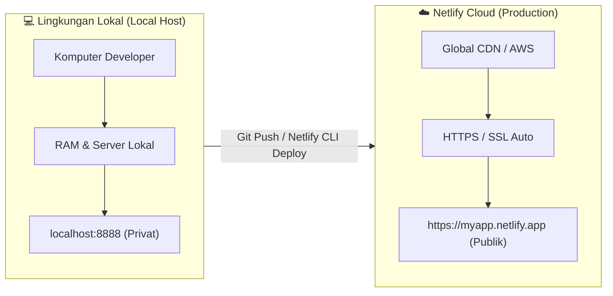
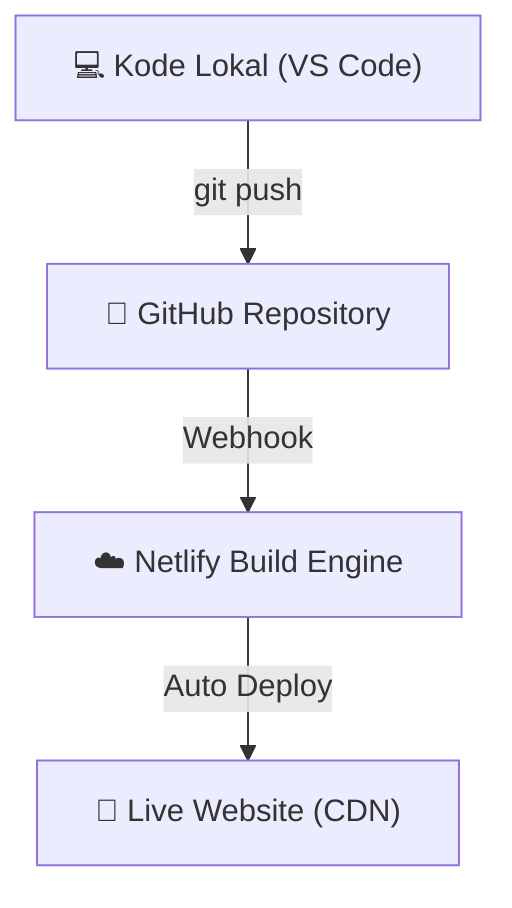

import { Steps } from '@astrojs/starlight/components';

Selamat datang di **Modul 1**! Sebagai seorang *developer*, tahap pertama dalam membuat aplikasi adalah menulis kode di komputer lokal Anda. Namun, agar aplikasi tersebut dapat diakses oleh pengguna dari seluruh dunia melalui browser, kode tersebut harus melalui proses yang disebut **Deployment**.

---

## 1. Apa Itu Deployment?

**Deployment** (Penggelaran/Penyebaran) adalah proses memindahkan aplikasi web yang telah selesai dibuat di komputer lokal (*Local Environment*) ke server cloud publik (*Production Environment*) sehingga dapat diakses melalui internet menggunakan nama domain (seperti `https://nama-aplikasi.netlify.app`).

### Mengapa Kita Membutuhkan Deployment?

Ketika Anda menjalankan aplikasi di komputer sendiri (`localhost:3000` atau `localhost:8888`), aplikasi tersebut hanya bisa diakses oleh komputer Anda sendiri. Pengguna internet lain tidak memiliki akses ke harddisk atau jaringan komputer lokal Anda.

:::note[Analogi Sederhana]
Menulis kode di komputer lokal diibaratkan seperti mengarang buku di buku catatan pribadi Anda. Deployment adalah proses mencetak buku tersebut dan meletakkannya di rak toko buku publik agar siapa saja dapat membacanya.
:::

---

## 2. Perbedaan Lingkungan: Local vs Production

Dalam dunia pengembangan perangkat lunak (*software development*), terdapat pemisahan lingkungan (*environment*) kerja. Berikut adalah perbandingan antara **Local Environment** dan **Production Environment**:

| Fitur / Karakteristik | Lingkungan Lokal (*Local Environment*) | Lingkungan Produksi (*Production Environment*) |
| :--- | :--- | :--- |
| **Alamat URL** | `http://localhost:3000` atau `http://127.0.0.1` | `https://aplikasiku.netlify.app` atau `https://mycompany.com` |
| **Aksesibilitas** | Hanya komputer Anda sendiri | Publik (Siapa saja yang memiliki koneksi internet) |
| **Keamanan (SSL/HTTPS)** | `http://` tanpa enkripsi | `https://` dengan sertifikat SSL aktif |
| **Database & API** | Database tiruan/lokal (`localhost:5432`) | Database cloud terenkripsi & skala besar |
| **Variabel Rahasia** | File `.env` lokal | Netlify Dashboard Environment Variables |
| **Toleransi Error** | Error ditampilkan lengkap di layar browser | Error disembunyikan untuk keamanan pengguna |

---

## 3. Komponen Utama Aplikasi Web di Cloud

Sebelum kita mulai me-deploy ke Netlify, penting untuk memahami 4 komponen dasar arsitektur web:

### A. Web Hosting / Server Cloud
Tempat penyimpanan file HTML, CSS, JavaScript, dan kode backend agar dapat dieksekusi 24/7. Netlify menggunakan arsitektur **CDN (Content Delivery Network)** global, artinya file web Anda akan diduplikasi ke puluhan server di berbagai belahan dunia agar pemuatan halaman terasa sangat cepat.

### B. Nama Domain & DNS
- **IP Address**: Alamat numerik server (contoh: `75.2.60.5`).
- **Domain Name**: Nama yang mudah diingat manusia (contoh: `google.com` atau `my-app.netlify.app`).
- **DNS (Domain Name System)**: Buku telepon internet yang menerjemahkan nama domain menjadi IP Address server.

### C. SSL / HTTPS Certificate
Enkripsi keamanan yang ditandai dengan ikon gembok di browser. SSL memastikan data yang dikirim pengguna (seperti kata sandi atau data pembayaran) tidak dapat diintip oleh pihak ketiga di jaringan. Netlify memberikan **SSL Gratis (Let's Encrypt)** secara otomatis pada setiap aplikasi yang di-deploy!

### D. Environment Variables (Variabel Lingkungan)
Tempat menyimpan kunci rahasia (*API Key*, *Database URL*, *Secret Key*) agar tidak ditulis langsung di dalam source code (*hardcoded*).

:::danger[Penting untuk Keamanan!]
Jangan pernah mengunggah file `.env` atau *Secret API Key* ke repository GitHub publik! Selalu gunakan menu *Environment Variables* di platform hosting seperti Netlify.
:::

---

## 4. Alur Kerja Otomatisasi (CI/CD)

Netlify mendukung alur kerja modern yang disebut **Continuous Integration & Continuous Deployment (CI/CD)**.

<Steps>
1. **Developer menulis kode** di komputer lokal (VS Code).
2. **Commit & Push** kode ke GitHub/GitLab repository.
3. **Netlify mendeteksi perubahan** secara otomatis via Webhook.
4. **Netlify menjalankan proses Build** di cloud.
5. **Aplikasi ter-update secara otomatis** dalam hitungan detik tanpa downtime!
</Steps>

---

## 5. Ringkasan & Langkah Selanjutnya

Di modul ini Anda telah mempelajari:
- Apa itu deployment dan mengapa aplikasi lokal harus di-deploy.
- Perbedaan mendasar antara `localhost` (lokal) dan `Production` (cloud).
- Konsep CDN, SSL, DNS, dan Environment Variables.
- Cara kerja CI/CD otomatis pada Netlify.

Pada **Modul 2**, kita akan langsung mempraktikkan deployment pertama kita: **Menyebarkan Website Statis (Vanilla HTML/CSS/JS)** ke Netlify!
