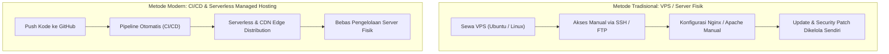
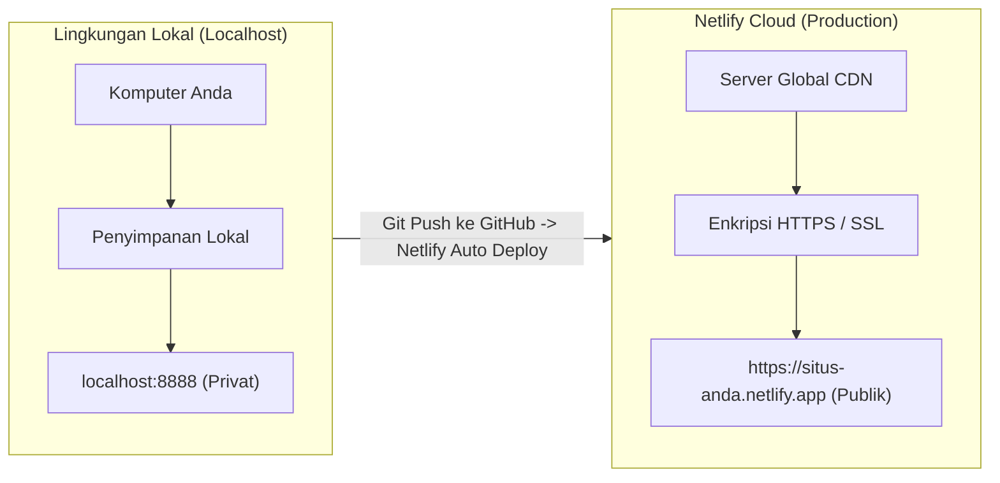
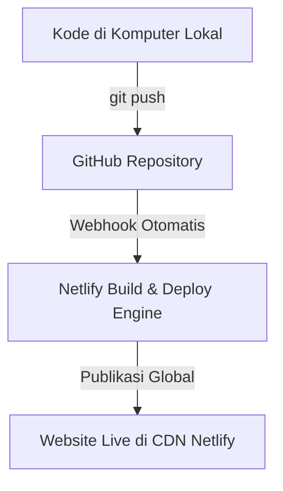

import { Steps } from '@astrojs/starlight/components';

Saat Anda mulai belajar pemrograman web, langkah pertama biasanya adalah menulis kode di komputer pribadi dan membukanya melalui browser di alamat seperti `localhost` atau membuka file HTML secara langsung. Namun, website tersebut belum dapat dilihat oleh orang lain di internet.

Agar website yang telah Anda buat dapat diakses oleh siapa saja dari mana saja, berkas-berkas kode tersebut harus melalui tahapan yang disebut **deployment**.

---

## 1. Pengertian Deployment

**Deployment** adalah proses memindahkan atau merilis aplikasi web dari komputer lokal (*Local Environment*) ke server yang terhubung dengan internet publik (*Production Environment*), sehingga website memiliki alamat resmi (seperti `https://nama-aplikasi.netlify.app`) dan dapat dikunjungi oleh pengguna secara online.

### Mengapa Deployment Diperlukan?

Ketika Anda membuat website di komputer sendiri, berkas HTML, CSS, dan JavaScript berada di penyimpanan lokal (harddisk/SSD komputer Anda). Pengguna internet di luar jaringan Anda tidak memiliki izin maupun jalur untuk mengakses komputer pribadi Anda.

:::note[Analogi Sederhana]
Menulis kode di komputer lokal diibaratkan seperti menulis catatan pada buku harian pribadi. Orang lain belum bisa membacanya. Deployment adalah proses mencetak tulisan tersebut dan memajangnya di perpustakaan atau toko buku publik agar dapat dibaca oleh masyarakat umum.
:::

---

## 2. Evolusi Deployment: Tradisional vs Modern

Untuk memahami mengapa platform cloud modern seperti Netlify sangat populer, kita perlu melihat bagaimana cara pengembang web merilis website dari masa ke masa.

### A. Traditional Deployment (Deploy Langsung ke VPS)

Pada pendekatan tradisional, pengembang harus menyewa komputer server virtual yang disebut **Virtual Private Server (VPS)** (misalnya DigitalOcean, Linode, atau AWS EC2):

1. **Akses Manual**: Pengembang masuk ke server jarak jauh menggunakan terminal melalui protokol **SSH (Secure Shell)** atau mengirimkan berkas via **FTP/SFTP** (seperti aplikasi FileZilla).
2. **Konfigurasi Web Server**: Pengembang harus menginstal dan mengonfigurasi perangkat lunak web server secara manual, seperti **Nginx** atau **Apache**.
3. **Keamanan & SSL Manual**: Pengembang wajib memperbarui sistem operasi (*OS security patch*), mengatur firewall port, dan memasang sertifikat SSL secara berkala menggunakan alat seperti Certbot.
4. **Tantangan Utama**:
   - **Tanggung Jawab Pemeliharaan**: Jika server kehabisan memori RAM atau mengalami gangguan sistem, website akan mati (*down*) dan pengembang harus memperbaikinya secara manual.
   - **Biaya Tetap**: Pengembang tetap harus membayar biaya sewa bulanan server meskipun website sedang sepi pengunjung.
   - **Tidak Otomatis**: Setiap kali ada pembaruan kode, pengembang harus mengunggah ulang berkas ke server atau menarik perubahan secara manual melalui SSH.

### B. Modern Deployment: CI/CD dan Serverless

Metode modern hadir untuk mengatasi kerumitan di atas, memindahkan fokus pengembang dari **mengurus infrastruktur server** menjadi **fokus membuat produk**:

1. **Deployment via CI/CD (Continuous Integration & Continuous Deployment)**:
   - **CI/CD** adalah alur kerja otomatisasi di mana setiap kali pengembang melakukan `git push` ke repositori seperti GitHub, sistem otomatis di cloud akan mendeteksi perubahan tersebut.
   - Server cloud akan langsung mengambil kode terbaru, mengujinya, dan mempublikasikannya ke internet secara instan tanpa perlu intervensi manual.
   - Jika terjadi kesalahan, pengembang dapat melakukan *rollback* (mengembalikan versi website ke commit sebelumnya) hanya dengan satu klik.

2. **Deployment via Serverless & Managed CDN Hosting (seperti Netlify)**:
   - Istilah **Serverless** bukan berarti tidak ada server sama sekali, melainkan **pengembang tidak perlu mengelola, merawat, atau memikirkan server fisik tersebut**.
   - Untuk website statis, platform modern menggunakan **Edge Network / Global CDN**. Berkas HTML, CSS, dan JavaScript disalin dan disebarkan ke puluhan server di seluruh dunia.
   - **Keuntungan Besar bagi Pemula**:
     - **Skala Otomatis (*Auto-Scaling*)**: Mampu menangani lonjakan ribuan pengunjung secara otomatis tanpa risiko server crash.
     - **Hemat Biaya**: Tersedia paket gratis yang sangat memadai untuk belajar (*scale-to-zero* saat tidak ada trafik).
     - **SSL Otomatis**: Enkripsi HTTPS sudah terpasang dan diperbarui secara otomatis tanpa biaya tambahan.

---

## 3. Perbandingan Metode Deployment

Berikut adalah tabel ringkasan perbandingan antara Traditional VPS dan Modern CI/CD Serverless:

| Aspek | Traditional Deployment (VPS) | Modern Deployment (Netlify / Serverless CI/CD) |
| :--- | :--- | :--- |
| **Pengelolaan Server** | Manual (Konfigurasi OS, Nginx, Firewall) | Dikelola penuh oleh platform cloud (*Zero Server Ops*) |
| **Cara Mengunggah Kode** | Manual via SSH, FTP, atau Git pull di VPS | Otomatis terpicu saat melakukan `git push` ke GitHub |
| **Sertifikat SSL (HTTPS)** | Dikonfigurasi dan diperpanjang manual | Otomatis aktif (*Let's Encrypt*) secara gratis |
| **Distribusi Berkas** | Terpusat pada satu lokasi server VPS | Tersebar di puluhan server **Global CDN** di seluruh dunia |
| **Toleransi Lonjakan Trafik**| Terbatas pada kapasitas RAM/CPU VPS | Skala otomatis (*Auto-scaling*) tanpa risiko server down |
| **Kemudahan bagi Pemula** | Membutuhkan keahlian sistem Linux & DevOps | Sangat ramah pemula, cukup menghubungkan repositori GitHub |

---

## 4. Perbedaan Lingkungan: Local vs Production

Dalam dunia pengembangan perangkat lunak, lingkungan kerja dipisahkan menjadi dua bagian utama:

| Karakteristik | Lingkungan Lokal (*Local Environment*) | Lingkungan Produksi (*Production Environment*) |
| :--- | :--- | :--- |
| **Alamat URL** | `http://localhost:3000` atau `http://127.0.0.1` | `https://nama-website.netlify.app` atau domain sendiri |
| **Aksesibilitas** | Hanya komputer Anda sendiri | Publik (seluruh pengguna internet) |
| **Keamanan (Protokol)** | `http://` tanpa enkripsi | `https://` dengan sertifikat SSL aktif |
| **Konektivitas** | Berjalan secara *offline* atau jaringan lokal | Wajib terkoneksi ke jaringan internet |
| **Penanganan Error** | Pesan kesalahan ditampilkan detail untuk proses perbaikan | Pesan kesalahan internal disembunyikan demi keamanan |

---

## 5. Komponen Utama Infrastruktur Web Cloud

Sebelum mempraktikkan proses deployment, penting bagi pemula untuk memahami istilah dasar dalam infrastruktur web:

### A. Web Hosting dan Content Delivery Network (CDN)
- **Web Hosting**: Tempat penyimpanan berkas website agar dapat diakses kapan saja di internet.
- **Content Delivery Network (CDN)**: Jaringan server yang tersebar di berbagai belahan dunia. Netlify menyalin berkas website Anda ke puluhan server CDN tersebut, sehingga saat pengunjung membuka website dari Indonesia, berkas akan dikirim dari server terdekat agar halaman termuat sangat cepat.

### B. Nama Domain dan DNS
- **IP Address**: Alamat numerik unik server (misalnya: `75.2.60.5`).
- **Domain Name**: Nama alamat website yang mudah dibaca dan diingat oleh manusia (misalnya: `google.com` atau `kalkulator-diskon.netlify.app`).
- **DNS (Domain Name System)**: Sistem yang bekerja seperti buku kontak telepon internet. DNS menerjemahkan nama domain yang Anda ketik di browser menjadi alamat IP server tujuan.

### C. Protokol HTTPS dan Sertifikat SSL
- **HTTPS (Hypertext Transfer Protocol Secure)**: Protokol komunikasi data terenkripsi yang ditandai dengan ikon gembok di *address bar* browser.
- Protokol ini memastikan bahwa data yang dikirimkan antara browser pengunjung dan server tidak dapat disadap oleh pihak ketiga. Netlify menyediakan sertifikat SSL gratis (*Let's Encrypt*) secara otomatis untuk setiap website yang di-deploy.

---

## 6. Alur Kerja Otomatisasi Deployment Modern (CI/CD)

Standar industri modern menghubungkan pengembang ke cloud melalui alur kerja otomatis:

<Steps>
1. **Menulis Kode**: Anda membuat atau memperbarui website di komputer lokal menggunakan teks editor (misalnya Visual Studio Code).
2. **Menyimpan Versi**: Anda mencatat perubahan kode dan mengirimkannya (*push*) ke layanan **GitHub**.
3. **Pemicu Otomatis (Webhook)**: GitHub memberi tahu Netlify bahwa terdapat versi kode terbaru.
4. **Proses Rilis Cloud**: Netlify menyalin berkas website ke jaringan CDN global secara otomatis.
5. **Website Terperbarui**: Dalam hitungan detik, pengguna di seluruh dunia sudah dapat melihat versi terbaru tanpa ada jeda (*downtime*).
</Steps>

---

## 7. Ringkasan Pembelajaran

Pada Modul 1 ini, Anda telah memahami konsep penting:
- Pengertian deployment sebagai proses membawa aplikasi dari lingkungan lokal ke server publik internet.
- Evolusi dari **Traditional Deployment (VPS)** yang memerlukan konfigurasi manual ke **Modern Deployment (CI/CD & Serverless)** yang otomatis dan bebas perawatan server fisik.
- Perbedaan utama antara `localhost` (khusus komputer pribadi) dan lingkungan produksi (dapat diakses masyarakat umum).
- Peran CDN dalam mempercepat loading web, fungsi DNS sebagai penerjemah nama domain, serta pentingnya HTTPS/SSL untuk keamanan.

Pada **Modul 2**, kita akan mempelajari dasar-dasar **Git dan GitHub** sebagai fondasi utama sebelum melakukan deployment otomatis ke Netlify.
