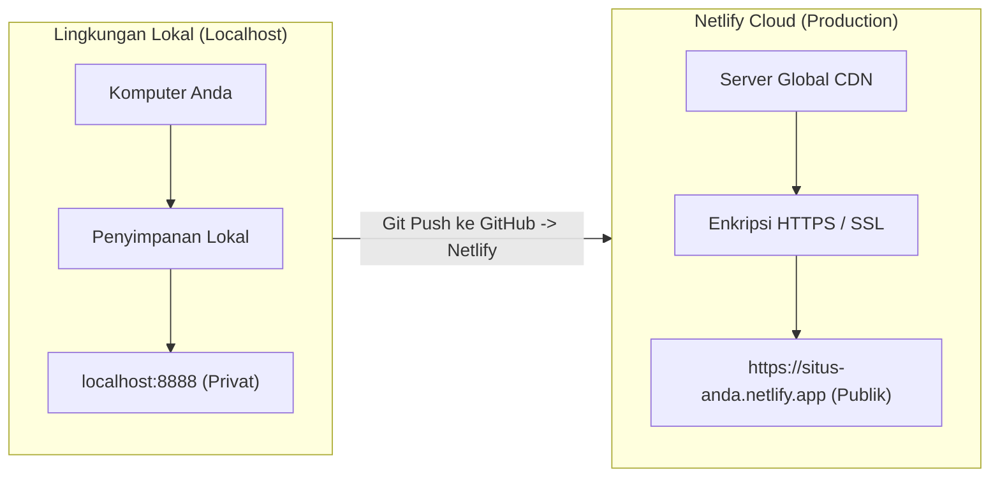
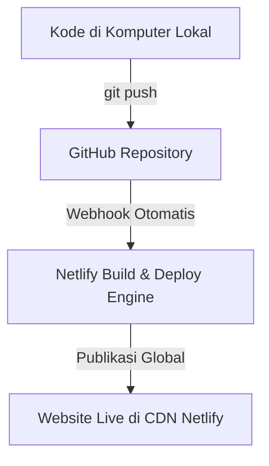

import { Steps } from '@astrojs/starlight/components';

Saat Anda mulai belajar pemrograman web, langkah pertama biasanya adalah menulis kode di komputer pribadi dan membukanya melalui browser di alamat seperti `localhost` atau membuka file HTML secara langsung. Namun, website tersebut belum dapat dilihat oleh orang lain di internet.

Agar website yang telah Anda buat dapat diakses oleh siapa saja dari mana saja, berkas-berkas kode tersebut harus melalui tahapan yang disebut **deployment**.

---

## 1. Pengertian Deployment

**Deployment** adalah proses memindahkan atau merilis aplikasi web dari komputer lokal (*Local Environment*) ke server yang terhubung dengan internet publik (*Production Environment*), sehingga website memiliki alamat resmi (seperti `https://nama-aplikasi.netlify.app`) dan dapat dikunjungi oleh pengguna secara online.

### Mengapa Deployment Diperlukan?

Ketika Anda membuat website di komputer sendiri, berkas HTML, CSS, dan JavaScript berada di penyimpanan lokal (harddisk/SSD komputer Anda). Pengguna internet di luar jaringan Anda tidak memiliki izin maupun jalur untuk mengakses komputer pribadi Anda.

:::note[Analogi Sederhana]
Menulis kode di komputer lokal diibaratkan seperti menulis catatan pada buku harian pribadi. Orang lain belum bisa membacanya. Deployment adalah proses mencetak tulisan tersebut dan memajangnya di perpustakaan atau toko buku publik agar dapat dibaca oleh masyarakat umum.
:::

---

## 2. Perbedaan Lingkungan: Local vs Production

Dalam dunia pengembangan perangkat lunak, lingkungan kerja dipisahkan menjadi dua bagian utama:

Berikut adalah tabel perbandingan antara lingkungan lokal dan lingkungan produksi:

| Karakteristik | Lingkungan Lokal (*Local Environment*) | Lingkungan Produksi (*Production Environment*) |
| :--- | :--- | :--- |
| **Alamat URL** | `http://localhost:3000` atau `http://127.0.0.1` | `https://nama-website.netlify.app` atau domain sendiri |
| **Aksesibilitas** | Hanya komputer Anda sendiri | Publik (seluruh pengguna internet) |
| **Keamanan (Protokol)** | `http://` tanpa enkripsi | `https://` dengan sertifikat SSL aktif |
| **Konektivitas** | Berjalan secara *offline* atau jaringan lokal | Wajib terkoneksi ke jaringan internet |
| **Penanganan Error** | Pesan kesalahan ditampilkan detail untuk proses perbaikan | Pesan kesalahan internal disembunyikan demi keamanan |

---

## 3. Komponen Utama Infrastruktur Web Cloud

Sebelum mempraktikkan proses deployment, penting bagi pemula untuk memahami istilah dasar dalam infrastruktur web:

### A. Web Hosting dan Content Delivery Network (CDN)
- **Web Hosting**: Komputer server yang terus menyala 24 jam sehari untuk menyimpan berkas website Anda agar dapat diakses kapan saja.
- **Content Delivery Network (CDN)**: Jaringan server yang tersebar di berbagai wilayah di dunia. Netlify menyalin berkas website Anda ke puluhan server CDN tersebut, sehingga saat pengunjung membuka website dari Indonesia, berkas akan dikirim dari server terdekat agar halaman termuat sangat cepat.

### B. Nama Domain dan DNS
- **IP Address**: Alamat numerik unik server (misalnya: `75.2.60.5`).
- **Domain Name**: Nama alamat website yang mudah dibaca dan diingat oleh manusia (misalnya: `google.com` atau `kalkulator-diskon.netlify.app`).
- **DNS (Domain Name System)**: Sistem yang bekerja seperti buku kontak telepon internet. DNS menerjemahkan nama domain yang Anda ketik di browser menjadi alamat IP server tujuan.

### C. Protokol HTTPS dan Sertifikat SSL
- **HTTPS (Hypertext Transfer Protocol Secure)**: Protokol komunikasi data terenkripsi yang ditandai dengan ikon gembok di *address bar* browser.
- Protokol ini memastikan bahwa data yang dikirimkan antara browser pengunjung dan server tidak dapat disadap oleh pihak ketiga. Netlify menyediakan sertifikat SSL gratis (*Let's Encrypt*) secara otomatis untuk setiap website yang di-deploy.

---

## 4. Alur Kerja Otomatisasi Deployment (CI/CD)

Pada era modern, developer tidak lagi mengunggah berkas website secara manual satu per satu menggunakan aplikasi transfer file lama. Standar industri saat ini menggunakan alur **Continuous Integration & Continuous Deployment (CI/CD)**:

<Steps>
1. **Menulis Kode**: Anda membuat atau memperbarui website di komputer lokal menggunakan teks editor (misalnya Visual Studio Code).
2. **Menyimpan Versi**: Anda mencatat perubahan kode dan mengirimkannya (*push*) ke layanan **GitHub**.
3. **Pemicu Otomatis (Webhook)**: GitHub memberi tahu Netlify bahwa terdapat versi kode terbaru.
4. **Proses Rilis Cloud**: Netlify menyalin berkas website ke jaringan CDN global secara otomatis.
5. **Website Terperbarui**: Dalam hitungan detik, pengguna di seluruh dunia sudah dapat melihat versi terbaru tanpa ada jeda (*downtime*).
</Steps>

---

## 5. Ringkasan Pembelajaran

Pada Modul 1 ini, Anda telah memahami konsep penting:
- Pengertian deployment sebagai proses membawa aplikasi dari lingkungan lokal ke server publik internet.
- Perbedaan utama antara `localhost` (khusus komputer pribadi) dan lingkungan produksi (dapat diakses masyarakat umum).
- Peran CDN dalam mempercepat loading web, fungsi DNS sebagai penerjemah nama domain, serta pentingnya HTTPS/SSL untuk keamanan.
- Gambaran umum alur kerja otomatisasi rilis menggunakan Git, GitHub, dan platform hosting Netlify.

Pada **Modul 2**, kita akan mempelajari dasar-dasar **Git dan GitHub** sebagai jembatan utama untuk mengelola kode sebelum melakukan deployment.
