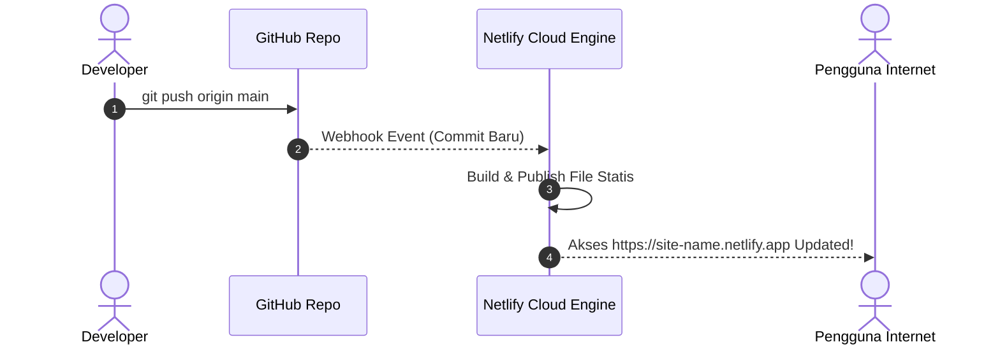

import { Steps, Tabs, TabItem } from '@astrojs/starlight/components';

Pada **Modul 2** ini, kita akan me-deploy aplikasi web statis pertama kita ke Netlify. Aplikasi yang digunakan berada di folder `sources/01-frontend-static/`.

---

## 1. Mengenal Aplikasi Web Statis

**Aplikasi Web Statis** adalah web yang terdiri dari berkas-berkas HTML, CSS, JavaScript, dan media (gambar/font) yang disajikan langsung ke browser pengguna tanpa memerlukan proses komputasi server berat di belakangnya.

### Struktur Source Code (`sources/01-frontend-static`)

```text
sources/01-frontend-static/
├── index.html       # Struktur antarmuka Kalkulator Diskon
├── style.css        # Tata letak dan desain visual
├── script.js        # Logika perhitungan di sisi browser (client-side)
├── netlify.toml     # Berkas konfigurasi deployment Netlify
└── README.md        # Ringkasan instruksi
```

---

## 2. File Konfigurasi: `netlify.toml`

`netlify.toml` adalah file konfigurasi utama yang dibaca Netlify saat membangun aplikasi Anda. Untuk web statis tanpa bundler (seperti Vite/Webpack), konfigurasinya sangat sederhana:

```toml
# netlify.toml
[build]
  publish = "."   # Direktori yang akan dipublikasikan (akar folder)

[[headers]]
  for = "/*"
  [headers.values]
    X-Frame-Options = "DENY"
    X-Content-Type-Options = "nosniff"
```

- `publish = "."`: Memberi tahu Netlify bahwa berkas `index.html` berada di direktori utama.

---

## 3. Cara 1: Deployment Menggunakan Netlify CLI (Terminal)

Netlify CLI memungkinkan Anda melakukan deployment langsung dari terminal komputer tanpa membuka browser terlebih dahulu.

<Steps>
1. **Buka Terminal** dan masuk ke folder proyek:
   ```bash
   cd sources/01-frontend-static
   ```

2. **Login ke Akun Netlify Anda**:
   ```bash
   npx netlify-cli login
   ```
   Browser akan terbuka otomatis untuk meminta persetujuan otentikasi.

3. **Uji Aplikasi secara Lokal (`netlify dev`)**:
   ```bash
   npx netlify-cli dev
   ```
   Perintah ini mensimulasikan web server lokal di `http://localhost:8888`.

4. **Deploy ke Draft / Preview Environment**:
   ```bash
   npx netlify-cli deploy
   ```
   - Pilihlah **Create & configure a new site**.
   - Tentukan nama tim (*Team*) dan nama situs (*Site name*).
   - Masukkan `.` saat ditanya *Publish directory*.
   - Netlify akan memberikan URL **Draft Preview** (contoh: `https://64a1b2c3--site-name.netlify.app`).

5. **Deploy ke Production Environment**:
   Setelah Anda memeriksa Draft Preview dan yakin tidak ada kesalahan, jalankan perintah production:
   ```bash
   npx netlify-cli deploy --prod
   ```
   Netlify akan memberikan **Live URL** resmi (contoh: `https://site-name.netlify.app`).
</Steps>

:::tip[Tips CLI]
Anda dapat menggunakan argumen `--prod` kapan saja ingin memperbarui versi live secara langsung dari terminal.
:::

---

## 4. Cara 2: Deployment Otomatis via GitHub Integration

Metode ini adalah *best-practice* di industri software engineering karena setiap kali Anda mengunggah kode ke GitHub, Netlify akan memperbarui situs secara otomatis.



<Steps>
1. **Upload Kode ke GitHub**:
   Buat repository baru di GitHub, lalu jalankan perintah Git di terminal:
   ```bash
   git init
   git add .
   git commit -m "feat: initial commit web statis"
   git branch -M main
   git remote add origin https://github.com/username/frontend-statis-demo.git
   git push -u origin main
   ```

2. **Buka Netlify Dashboard**:
   - Masuk ke [app.netlify.com](https://app.netlify.com).
   - Klik tombol **Add new site** > **Import from an existing project**.

3. **Hubungkan Provider Git**:
   - Pilih **GitHub** dan berikan izin akses ke repository `frontend-statis-demo`.

4. **Konfigurasi Build Settings**:
   - **Branch to deploy**: `main`
   - **Build command**: (Kosongkan untuk web statis tanpa bundler)
   - **Publish directory**: `.` (atau biarkan kosong jika ada `netlify.toml`)

5. **Deploy Site**:
   - Klik **Deploy site**. Dalam hitungan detik, situs statis Anda telah *Live*!
</Steps>

---

## 5. Pengujian & Verifikasi Hasil Deployment

Buka URL produksi yang diberikan Netlify di browser Anda:
1. Pastikan ikon gembok **HTTPS** aktif.
2. Uji formulir **Kalkulator Diskon**:
   - Masukkan harga: `100000`
   - Masukkan diskon: `25`
   - Klik **Hitung Total**.
3. Pastikan hasil perhitungan (Potongan: Rp 25.000, Total Bayar: Rp 75.000) muncul dengan lancar tanpa error di *Developer Tools Console* (F12).

---

## 6. Troubleshooting Masalah Umum

:::warning[Masalah: Tampilan 404 Page Not Found saat membuka URL?]
**Penyebab**: File utama tidak bernama `index.html` atau lokasi `publish` directory di `netlify.toml` salah.
**Solusi**: Pastikan file utama benarnama `index.html` (huruf kecil semua) dan berada tepat di folder publik yang di-publish.
:::

:::warning[Masalah: File CSS atau JS tidak terkonfigurasi/tidak muncul warna & style?]
**Penyebab**: Path di `index.html` menggunakan absolute path lokal yang salah seperti `C:/User/project/style.css`.
**Solusi**: Gunakan relative path sederhana di HTML: `<link rel="stylesheet" href="style.css">` dan `<script src="script.js"></script>`.
:::

---

## Ringkasan Modul 2

Selamat! Anda baru saja berhasil me-deploy web statis ke Netlify melalui dua metode utama:
1. **Netlify CLI** (`netlify deploy --prod`) untuk pengujian dan penyebaran cepat via terminal.
2. **Git & GitHub Integration** untuk otomatisasi rilis setiap kali terjadi perubahan kode.

Pada **Modul 3**, kita akan melangkah lebih jauh: **Membuat dan Me-deploy Backend Serverless TypeScript** menggunakan Netlify Functions!
