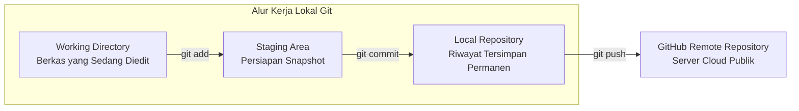

import { Steps } from '@astrojs/starlight/components';

Sebagai seorang pengembang web, mengelola berkas kode dan mencatat setiap perubahan merupakan keterampilan yang sangat penting. Sebelum melakukan deployment ke layanan cloud seperti Netlify, Anda perlu memahami cara kerja **Git** dan **GitHub**.

---

## 1. Mengenal Version Control System (VCS)

**Version Control System (VCS)** adalah sistem yang mencatat setiap riwayat perubahan pada berkas kode dari waktu ke waktu. Dengan sistem ini, Anda dapat melihat riwayat perubahan, membandingkan perbedaan kode, hingga mengembalikan kode ke versi sebelumnya jika terjadi kesalahan (*bug*).

### Mengapa Kita Membutuhkan Git?

Tanpa sistem kontrol versi, pemula sering kali menduplikasi folder secara manual dengan nama-nama seperti:
- `website-final/`
- `website-final-beneran/`
- `website-final-fix-banget/`

Cara di atas sangat rawan membingungkan dan memakan kapasitas penyimpanan. Git memecahkan masalah ini dengan mencatat riwayat perubahan (*commit*) secara rapi di dalam satu folder proyek yang sama.

### Perbedaan Git dan GitHub

Banyak pemula mengira Git dan GitHub adalah hal yang sama. Keduanya memiliki fungsi yang berbeda namun saling melengkapi:

| Aspek | Git | GitHub |
| :--- | :--- | :--- |
| **Kategori** | Perangkat lunak / aplikasi (*tool*) | Layanan berbasis web (*cloud hosting*) |
| **Instalasi** | Dipasang di komputer lokal Anda | Diakses melalui browser di `github.com` |
| **Fungsi Utama** | Mencatat riwayat perubahan kode | Menyimpan salinan repository Git secara online |
| **Akses Jaringan** | Bekerja secara *offline* | Membutuhkan koneksi internet |
| **Kolaborasi** | Berfokus pada pengelolaan lokal | Memudahkan berbagi kode dan kerja tim |

:::note[Analogi Sederhana]
Git diibaratkan seperti kamera yang mengambil foto (*snapshot*) kondisi proyek Anda setiap kali ada perubahan penting. Sementara itu, GitHub adalah album foto daring (seperti Google Drive atau cloud storage) tempat Anda mengunggah dan menyimpan foto-foto tersebut agar aman dan dapat diakses dari mana saja.
:::

---

## 2. Tiga Area Kerja dalam Git

Sebelum menjalankan perintah, penting untuk memahami alur perpindahan berkas dalam Git:



1. **Working Directory (Ruang Kerja)**: Folder proyek tempat Anda membuat, mengedit, atau menghapus berkas HTML, CSS, dan JavaScript.
2. **Staging Area (Area Persiapan)**: Tempat mengumpulkan berkas-berkas yang perubahannya siap untuk disimpan ke riwayat. Anda memilih berkas mana saja yang ingin disertakan.
3. **Local Repository (Penyimpanan Riwayat Lokal)**: Database internal Git (folder tersembunyi `.git`) yang menyimpan rekaman riwayat perubahan secara permanen di komputer Anda.
4. **Remote Repository (GitHub)**: Salinan repository yang berada di server cloud GitHub di internet.

---

## 3. Konfigurasi Awal Git

Setelah menginstal Git pada komputer Anda, langkah pertama adalah mengenalkan identitas Anda. Jalankan perintah berikut pada Terminal atau Git Bash:

```bash
# 1. Menentukan nama Anda
git config --global user.name "Nama Lengkap Anda"

# 2. Menentukan email yang terdaftar di akun GitHub
git config --global user.email "email.anda@contoh.com"

# 3. Memverifikasi konfigurasi yang telah disimpan
git config --list
```

---

## 4. Alur Perintah Dasar Git (Step-by-Step)

Berikut adalah panduan langkah demi langkah mengelola proyek web menggunakan Git dari awal:

<Steps>
1. **Inisialisasi Repository Git Baru**:
   Buka terminal di dalam folder proyek Anda, lalu ketik:
   ```bash
   git init
   ```
   Perintah ini akan membuat folder tersembunyi `.git` yang menandakan bahwa folder proyek tersebut kini dipantau oleh Git.

2. **Memeriksa Status Berkas**:
   ```bash
   git status
   ```
   Perintah ini menampilkan status berkas: berkas baru yang belum dipantau (*untracked*), berkas yang sudah dimodifikasi, atau berkas yang sudah masuk ke staging area.

3. **Memasukkan Berkas ke Staging Area**:
   ```bash
   # Memasukkan seluruh berkas sekaligus
   git add .
   ```
   Tanda titik (`.`) berarti menambahkan semua berkas yang baru atau telah diubah di direktori saat ini ke ruang persiapan (*staging area*).

4. **Menyimpan Riwayat Perubahan (Commit)**:
   ```bash
   git commit -m "feat: inisialisasi struktur web statis"
   ```
   Flag `-m` digunakan untuk menuliskan pesan keterangan. Tuliskan pesan commit yang jelas dan deskriptif mengenai perubahan yang Anda buat.
</Steps>

---

## 5. Menghubungkan Proyek Lokal ke GitHub

Setelah memiliki riwayat commit di komputer lokal, langkah selanjutnya adalah mengunggahnya ke GitHub agar dapat dibaca oleh Netlify untuk proses deployment.

<Steps>
1. **Buat Repository Baru di GitHub**:
   - Buka [github.com](https://github.com) dan masuk ke akun Anda.
   - Klik tombol **New** (ikon plus di pojok kanan atas) untuk membuat repository baru.
   - Berikan nama repository, misalnya: `kalkulator-diskon-web`.
   - Pilih visibilitas **Public** dan biarkan opsi lainnya (*README*, *.gitignore*) tidak dicentang karena proyek lokal sudah dibuat.
   - Klik **Create repository**.

2. **Ubah Nama Branch Utama Menjadi `main`**:
   ```bash
   git branch -M main
   ```

3. **Tambahkan Alamat Remote GitHub**:
   Salin URL repository dari halaman GitHub Anda, lalu jalankan:
   ```bash
   git remote add origin https://github.com/username-anda/kalkulator-diskon-web.git
   ```
   *Keterangan*: `origin` adalah nama alias default untuk server remote GitHub Anda.

4. **Kirim Kode ke GitHub (Push)**:
   ```bash
   git push -u origin main
   ```
   Flag `-u` (singkatan dari *upstream*) menghubungkan branch lokal `main` ke branch `main` di GitHub, sehingga pada push berikutnya Anda cukup mengetikkan `git push`.
</Steps>

---

## 6. Alur Kerja Sehari-hari Saat Terjadi Perubahan Kode

Setiap kali Anda mengedit kode website (misalnya mengubah warna tampilan di `style.css` atau menambahkan teks baru di `index.html`), ulangi siklus 3 perintah utama berikut:

```bash
# 1. Masukkan perubahan ke staging
git add .

# 2. Catat riwayat dengan pesan jelas
git commit -m "style: perbarui warna tombol hitung"

# 3. Kirim perubahan ke GitHub
git push
```

---

## 7. Ringkasan Pembelajaran

Pada Modul 2 ini, Anda telah memahami:
- Fungsi Version Control System (VCS) untuk mengamankan dan mendokumentasikan riwayat kode.
- Perbedaan antara Git (perangkat lokal) dan GitHub (penyimpanan cloud).
- Tiga tahapan berkas: *Working Directory*, *Staging Area* (`git add`), dan *Local Repository* (`git commit`).
- Cara menghubungkan repository lokal ke GitHub menggunakan `git remote add origin` dan mengunggahnya via `git push`.

Pada **Modul 3**, kita akan menggunakan repository GitHub yang telah siap ini untuk mempraktikkan **Deploy Website Statis ke Netlify** secara cepat dan otomatis.
