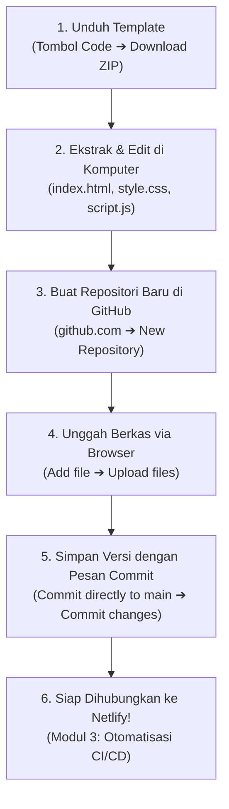

import { Steps } from '@astrojs/starlight/components';

Sebagai seorang pengembang web pemula, menyimpan dan mengelola berkas kode secara aman di lingkungan cloud merupakan langkah awal yang sangat penting sebelum melakukan proses deployment. 

Banyak pemula merasa terintimidasi oleh tampilan terminal hitam dan baris perintah (CLI) yang rumit saat pertama kali belajar Git. Kabar baiknya, platform **GitHub** menyediakan antarmuka web (*browser-based*) yang sangat lengkap dan ramah pengguna. Anda dapat mengunduh starter code, membuat repositori baru, mengunggah berkas, hingga mencatat riwayat perubahan (*commit*) langsung dari browser Anda tanpa mengetik satu pun perintah di command line!

---

## 1. Mengenal GitHub dan Penyimpanan Berbasis Cloud

Sebelum memulai praktik, mari kita pahami konsep dasarnya terlebih dahulu:

- **Version Control System (VCS)**: Sistem yang mencatat riwayat versi berkas dari waktu ke waktu. Jika Anda melakukan kesalahan saat mengubah kode, Anda dapat melihat kembali versi sebelumnya tanpa perlu menduplikasi folder secara manual (seperti `proyek-final`, `proyek-final-banget`).
- **GitHub**: Platform berbasis cloud terpopuler di dunia yang digunakan oleh puluhan juta developer untuk menyimpan salinan repositori kode secara online, membagikan proyek, dan berkolaborasi.

### Mengapa Menggunakan Antarmuka Web GitHub?

Bagi pelajar SMA kelas 12 maupun mahasiswa awal, menggunakan antarmuka web GitHub memberikan beberapa keuntungan nyata:
1. **Tanpa Perlu Menginstal Aplikasi Tambahan**: Anda tidak perlu memasang Git CLI, Git Bash, atau mengonfigurasi SSH keys di laptop.
2. **Visual dan Intuitif**: Seluruh alur kerja dilakukan dengan klik tombol, *drag and drop* berkas, serta formulir teks yang mudah dimengerti.
3. **Langsung Terintegrasi dengan Cloud Deployment**: Repositori GitHub yang Anda buat di browser dapat langsung dihubungkan ke Netlify Dashboard pada Modul 3.

---

## 2. Mengunduh Kode Proyek Starter (Download as ZIP)

Dalam proses belajar, pengajar sering kali membagikan repositori berisi kode awal (*starter code*) atau template yang perlu Anda unduh ke komputer lokal untuk dipelajari atau dimodifikasi.

Berikut cara mengunduh kode proyek dari GitHub tanpa menggunakan terminal:

<Steps>
1. **Buka Halaman Repositori Proyek di Browser**:
   Kunjungi tautan repositori GitHub yang dibagikan oleh pengajar atau materi pelatihan.

2. **Klik Tombol `Code` (`<> Code`)**:
   Di sisi kanan atas daftar berkas, klik tombol hijau bertuliskan **`Code`** (ikon `Code`).

3. **Pilih Opsi "Download ZIP"**:
   Pada menu dropdown yang muncul, klik opsi paling bawah: **Download ZIP**. Browser Anda akan segera mengunduh seluruh berkas proyek dalam bentuk satu berkas arsip `.zip`.

4. **Ekstrak Berkas ZIP di Komputer Lokal**:
   - Temukan berkas `.zip` yang baru saja diunduh di folder *Downloads*.
   - Klik kanan pada berkas zip tersebut, lalu pilih **Extract All...** (Windows) atau klik dua kali (macOS).
   - Simpan folder hasil ekstrak di lokasi kerja yang mudah ditemukan, misalnya di dalam folder `Dokumen/ProyekWeb/`.
</Steps>

Di dalam folder proyek web statis kita, terdapat 3 berkas inti:
- `index.html`: Berkas struktur utama tampilan (kalkulator diskon).
- `style.css`: Berkas pemanis tampilan dan tata letak.
- `script.js`: Berkas logika penghitungan diskon interaktif.

---

## 3. Membuat Repositori Baru di GitHub via Browser

Setelah Anda memiliki berkas website di komputer, saatnya membuat tempat penyimpanan (*repository*) pribadi di akun GitHub Anda:

<Steps>
1. **Masuk ke Akun GitHub**:
   Buka [github.com](https://github.com) pada browser Anda, lalu lakukan login (*Sign In*). Jika belum memiliki akun, daftarkan diri terlebih dahulu melalui tombol *Sign Up*.

2. **Buka Halaman Pembuatan Repositori Baru**:
   - Di pojok kanan atas halaman, klik ikon tanda tambah (**"+"**) di samping foto profil Anda, lalu pilih **"New repository"**.
   - Atau, Anda juga dapat mengeklik tombol hijau bertuliskan **"New"** yang berada di panel kiri dashboard utama Anda.

3. **Isi Informasi Repositori**:
   - **Repository name**: Ketikkan nama proyek Anda menggunakan huruf kecil dan tanda hubung, misalnya: `kalkulator-diskon-web`.
   - **Description** (Opsional): Tuliskan deskripsi singkat, misalnya: *Aplikasi web statis kalkulator diskon untuk latihan deployment*.
   - **Visibility**: Pastikan memilih opsi **Public** agar website Anda nantinya dapat dibaca dan dideploy secara otomatis oleh Netlify.

4. **Pengaturan Inisialisasi**:
   - Pada bagian *Initialize this repository with*, Anda dapat membiarkan opsi (*Add a README file*, *.gitignore*, *license*) tidak dicentang.
   
5. **Klik Tombol "Create repository"**:
   Klik tombol hijau di bagian bawah halaman. GitHub akan langsung membuat repositori baru yang siap menerima unggahan berkas Anda.
</Steps>

---

## 4. Mengunggah Berkas Proyek Langsung (Upload Files & Commit Message)

Sekarang kita akan memasukkan berkas `index.html`, `style.css`, dan `script.js` ke dalam repositori GitHub yang baru saja dibuat:

<Steps>
1. **Akses Menu Unggah Berkas**:
   - Pada halaman repositori baru yang masih kosong, cari teks panduan bertuliskan:  
     *“...or create a new repository on the command line... or **uploading an existing file**.”*
   - Klik tautan bertuliskan **"uploading an existing file"**.
   - *(Catatan: Jika repositori Anda sudah memiliki berkas sebelumnya, klik tombol **"Add file"** di kanan atas tabel berkas, lalu pilih **"Upload files"**)*.

2. **Pilih dan Unggah Berkas (Drag and Drop)**:
   - Tarik (*drag*) ketiga berkas (`index.html`, `style.css`, dan `script.js`) langsung dari File Explorer / Finder di komputer Anda, lalu lepaskan (*drop*) tepat di dalam kotak bergaris putus-putus pada halaman browser.
   - Atau, klik tombol **"choose your files"** untuk memilih berkas satu per satu dari folder komputer Anda.
   - Tunggu beberapa detik hingga indikator bar hijau selesai dan seluruh nama berkas muncul di daftar antrean.

3. **Menuliskan Pesan Commit (Commit Message)**:
   Gulir ke bagian bawah halaman menuju kotak bertajuk **"Commit changes"**:
   - **Kotak Pertama (Ringkasan Commit)**: Ketikkan pesan singkat yang menjelaskan tindakan Anda, misalnya:  
     `feat: upload berkas kalkulator diskon awal`
   - **Kotak Kedua (Deskripsi Rinci - Opsional)**: Anda dapat menambahkan keterangan tambahan jika diperlukan.
   - **Target Branch**: Pastikan opsi radio button tercentang pada **"Commit directly to the `main` branch"**.

4. **Klik Tombol Hijau "Commit changes"**:
   Klik tombol hijau **"Commit changes"** di bagian bawah.
</Steps>

> [!NOTE]
> **Apa itu "Commit changes"?**  
> Dalam dunia pengembangan perangkat lunak, mengeklik tombol *Commit changes* sama dengan mengambil jepretan (*snapshot*) resmi kondisi kode Anda saat itu. Setiap commit akan dicatat lengkap dengan nama akun Anda, tanggal, jam, dan pesan keterangan yang Anda tuliskan.

Setelah proses selesai, halaman repositori Anda akan menampilkan daftar ketiga berkas tersebut secara rapi di bawah branch `main`.

---

## 5. Cara Memperbarui Berkas Kode di Masa Depan

Bagaimana jika setelah website dibuat, Anda ingin mengubah tampilan warna tombol atau memperbaiki kesalahan ketik pada teks HTML? Anda dapat memperbaruinya langsung melalui browser dengan dua pilihan cara:

### Cara 1: Mengedit Berkas Langsung di Browser GitHub (Sangat Praktis untuk Perubahan Ringan)
1. Di halaman repositori GitHub Anda, klik berkas yang ingin diubah, misalnya klik `index.html`.
2. Klik ikon pensil bertuliskan **"Edit this file"** di pojok kanan atas tampilan kode.
3. Lakukan pengeditan teks atau kode langsung di editor web tersebut.
4. Klik tombol hijau **"Commit changes..."** di pojok kanan atas, tuliskan pesan commit baru (contoh: `fix: perbarui teks judul promo`), lalu klik **"Commit changes"**.

### Cara 2: Mengunggah Ulang Berkas yang Telah Diedit di Komputer
1. Jika Anda mengedit kode di aplikasi komputer (seperti VS Code atau Notepad), simpan berkas tersebut.
2. Buka repositori di GitHub, klik menu **"Add file"** $
ightarrow$ **"Upload files"**.
3. Tarik berkas yang baru diedit ke area unggah (pastikan nama berkasnya sama persis).
4. Tulis pesan commit (contoh: `style: ganti warna latar belakang di style.css`), lalu klik **"Commit changes"**.
5. GitHub secara otomatis akan memperbarui berkas lama dengan versi terbaru Anda!

---

## 6. Diagram Alur Pengelolaan Berkas GitHub Web

Berikut ringkasan visual dari alur kerja berbasis browser yang baru saja kita pelajari:

---

## 7. Ringkasan Pembelajaran

Pada Modul 2 ini, Anda telah menguasai:
- Konsep dasar Version Control dan peran GitHub sebagai penyimpanan kode berbasis cloud.
- Cara mengunduh starter code tanpa terminal menggunakan tombol **Code $
ightarrow$ Download ZIP**.
- Cara membuat repositori baru berstatus **Public** di GitHub melalui antarmuka web browser.
- Cara mengunggah berkas proyek langsung menggunakan fitur **Upload files** serta pentingnya mengisi **Commit message** sebelum menekan **Commit changes**.
- Cara memperbarui berkas kode di masa depan langsung via browser web.

Pada **Modul 3**, kita akan menghubungkan repositori GitHub yang telah Anda buat ini ke **Netlify Dashboard** agar website kalkulator diskon Anda dapat online dan diakses oleh publik secara gratis!
