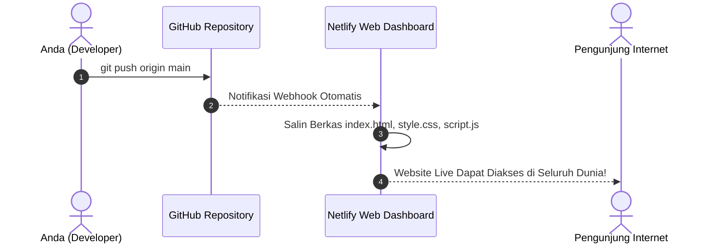

import { Steps } from '@astrojs/starlight/components';

Pada **Modul 3** ini, kita akan mempraktikkan proses deployment website statis ke platform cloud Netlify. Kita akan menggunakan metode yang paling mudah dan ramah bagi pemula, yaitu **deployment langsung melalui antarmuka web Netlify Dashboard** yang terhubung ke repositori GitHub, **tanpa perlu menggunakan command line** dan **tanpa memerlukan berkas `netlify.toml`**.

Contoh proyek yang digunakan adalah aplikasi web kalkulator diskon yang terletak di direktori `sources/01-frontend-static/`.

---

## 1. Mengenal Karakteristik Website Statis

**Website Statis** adalah jenis website yang terdiri dari berkas-berkas siap pakai seperti HTML, CSS, JavaScript, serta media (gambar atau font). Berkas-berkas ini disajikan langsung ke browser pengunjung tanpa membutuhkan proses komputasi basis data (*database*) atau runtime server sisi belakang (*backend*) yang kompleks.

### Keunggulan Website Statis:
- **Cepat dan Ringan**: Berkas disebarkan langsung ke jaringan CDN global sehingga halaman terbuka secara instan.
- **Hemat Biaya**: Dapat di-host secara gratis pada paket pemula Netlify dengan kuota yang sangat memadai untuk belajar.
- **Aman**: Karena tidak memiliki server database langsung, risiko celah keamanan server sangat minim.

### Struktur Berkas Proyek (`sources/01-frontend-static/`)

```text
sources/01-frontend-static/
├── index.html       # Struktur tampilan antarmuka Kalkulator Diskon
├── style.css        # Tata letak, warna, dan gaya visual halaman
├── script.js        # Logika perhitungan diskon di sisi browser (client-side)
└── README.md        # Panduan dan petunjuk proyek
```

Untuk website statis murni tanpa alat perakit (*bundler* seperti Vite atau Webpack), Netlify secara cerdas dapat langsung mendeteksi berkas `index.html` di dalam repositori Anda secara otomatis tanpa perlu menambahkan berkas konfigurasi khusus seperti `netlify.toml`.

---

## 2. Mengapa Menggunakan Netlify Dashboard (Web UI)?

Bagi siswa SMA/SMK maupun mahasiswa tingkat awal yang baru memulai, menggunakan antarmuka grafis web (*dashboard*) Netlify memiliki banyak kelebihan:

1. **Tanpa Instalasi Tambahan**: Anda tidak perlu menginstal peralatan Netlify CLI tambahan di terminal komputer Anda.
2. **Visual dan Transparan**: Seluruh riwayat deployment, status rilis, pratinjau situs, dan pengaturan domain dapat dilihat dan dikelola dengan jelas melalui browser.
3. **Terintegrasi Penuh dengan GitHub**: Cukup sekali menghubungkan akun GitHub, seluruh proses rilis berikutnya akan berjalan otomatis (*Continuous Deployment*).

---

## 3. Panduan Deployment via Netlify Dashboard (Step-by-Step)

Pastikan Anda telah mengunggah proyek website ke repositori GitHub seperti yang telah dipelajari pada **Modul 2**. Selanjutnya, ikuti langkah-langkah berikut:

<Steps>
1. **Masuk ke Netlify Dashboard**:
   - Buka browser dan kunjungi [app.netlify.com](https://app.netlify.com).
   - Klik tombol **Sign in with GitHub** untuk masuk menggunakan akun GitHub Anda.
   
2. **Mulai Menambahkan Situs Baru**:
   - Pada halaman utama Dashboard Netlify, klik tombol **Add new site**.
   - Pilih opsi **Import an existing project** dari menu dropdown yang muncul.

3. **Pilih Penyedia Git (GitHub)**:
   - Pada pilihan *Connect to Git provider*, klik tombol **GitHub**.
   - Jendela otorisasi akan terbuka untuk menghubungkan akun Netlify ke akun GitHub Anda.
   - Pada daftar repositori, pilih repositori proyek Anda (misalnya: `kalkulator-diskon`).

4. **Konfigurasi Pengaturan Rilis (Build Settings)**:
   Netlify akan menampilkan formulir konfigurasi rilis di layar browser:
   - **Branch to deploy**: Pastikan terisi branch utama Anda, yaitu `main`.
   - **Base directory**: Biarkan kosong.
   - **Build command**: Biarkan kosong (karena website statis Vanilla HTML/CSS/JS tidak membutuhkan kompilasi).
   - **Publish directory**: Biarkan kosong (atau isi dengan tanda titik `.` karena berkas `index.html` berada langsung di akar folder repositori).

5. **Lakukan Deployment**:
   - Klik tombol **Deploy kalkulator-diskon** (atau **Deploy site**) di bagian bawah formulir.
   - Netlify akan memproses berkas Anda. Dalam waktu beberapa detik, status situs akan berubah dari *Building* menjadi **Published**.
   - Netlify akan memberikan tautan publik acak (contoh: `https://heuristic-curie-123456.netlify.app`). Klik tautan tersebut untuk membuka website Anda yang kini telah resmi online di internet!
</Steps>



---

## 4. Mengubah Nama Domain Website

Nama domain bawaan yang diberikan Netlify sering kali berupa kombinasi kata acak yang sulit diingat. Anda dapat mengubahnya menjadi nama yang lebih rapi secara gratis langsung dari Netlify Dashboard:

<Steps>
1. Pada halaman situs Anda di Netlify Dashboard, buka menu **Site configuration** di bilah navigasi sebelah kiri.
2. Pilih sub-menu **General** > **Site details**.
3. Klik tombol **Change site name**.
4. Masukkan nama yang Anda inginkan (misalnya: `kalkulator-diskon-budi`).
5. Klik **Save**. Tautan website Anda kini berubah menjadi `https://kalkulator-diskon-budi.netlify.app`.
</Steps>

---

## 5. Membuktikan Alur Otomatisasi CI/CD (Continuous Deployment)

Keunggulan terbesar dari menghubungkan GitHub ke Netlify adalah alur pembaruan otomatis tanpa perlu menyentuh Netlify Dashboard lagi:

<Steps>
1. Buka proyek Anda di teks editor (Visual Studio Code).
2. Lakukan perubahan kecil, misalnya mengubah teks judul di `index.html` atau mengganti warna tombol di `style.css`.
3. Buka terminal di komputer Anda, lalu jalankan alur Git standar:
   ```bash
   git add .
   git commit -m "style: perbarui warna tombol kalkulator"
   git push
   ```
4. Buka kembali browser pada tab **Deploys** di Netlify Dashboard Anda.
5. Anda akan melihat bahwa Netlify langsung mendeteksi adanya commit baru secara otomatis, melakukan proses rilis baru, dan memperbarui website live Anda dalam hitungan detik tanpa perlu melakukan apa pun di Netlify!
</Steps>

---

## 6. Pengujian dan Verifikasi Hasil Deployment

Setelah website Anda berhasil dipublikasikan, lakukan pengujian kualitas dasar melalui browser:

1. **Pemeriksaan Enkripsi HTTPS**: Periksa apakah ikon gembok pada bilah alamat browser terkunci dengan aman (*Connection is secure*).
2. **Uji Fungsionalitas Kalkulator**:
   - Masukkan harga awal: `100000`.
   - Masukkan persentase diskon: `20`.
   - Klik tombol **Hitung Diskon**.
   - Pastikan rincian potongan (Rp 20.000) dan total pembayaran (Rp 80.000) tampil dengan benar.
3. **Pemeriksaan Console Browser**: Tekan tombol `F12` (Developer Tools) dan buka tab **Console**. Pastikan tidak terdapat pesan kesalahan berwarna merah.

---

## 7. Penyelesaian Masalah Umum (Troubleshooting)

:::caution[Kendala: Halaman 404 Page Not Found saat URL Dibuka]
- **Penyebab**: Netlify tidak menemukan berkas `index.html` pada akar repositori GitHub Anda.
- **Solusi**: Pastikan berkas utama bernama persis `index.html` (menggunakan huruf kecil semua) dan berada langsung di akar repositori, bukan di dalam subfolder yang tidak terdaftar.
:::

:::caution[Kendala: Tampilan Halaman Polos Tanpa CSS atau Script Tidak Jalan]
- **Penyebab**: Penggunaan tautan berkas absolut lokal (seperti `href="C:/Users/Nama/Desktop/style.css"`). Komputer server cloud tidak dapat mengakses jalur harddisk komputer pribadi Anda.
- **Solusi**: Gunakan jalur berkas relatif pada tag HTML, misalnya: `<link rel="stylesheet" href="style.css">` dan `<script src="script.js"></script>`.
:::

:::caution[Kendala: Berfungsi di Windows tapi 404 di Netlify]
- **Penyebab**: Sistem operasi Windows bersifat *case-insensitive* (tidak membedakan huruf besar dan kecil), sedangkan server Netlify berbasis Linux yang bersifat *case-sensitive*. Jika nama berkas adalah `Index.html`, server Linux tidak akan mengenalnya sebagai `index.html`.
- **Solusi**: Selalu gunakan huruf kecil untuk seluruh nama berkas website (`index.html`, `style.css`, `script.js`).
:::

---

## 8. Ringkasan Pembelajaran

Pada Modul 3 ini, Anda telah berhasil:
- Memahami struktur berkas dan keunggulan website statis tanpa ketergantungan server yang rumit.
- Mempublikasikan website langsung dari repositori GitHub ke Netlify Dashboard tanpa command line dan tanpa berkas konfigurasi tambahan.
- Mengatur nama subdomain resmi di Netlify agar mudah dibagikan kepada orang lain.
- Membuktikan alur otomatisasi rilis berkelanjutan (*Continuous Deployment*) setiap kali Anda melakukan `git push`.

Pada **Modul 4**, kita akan mengukur dan menguji kualitas website yang telah kita rilis menggunakan **Google Lighthouse** untuk melakukan benchmark performa!
