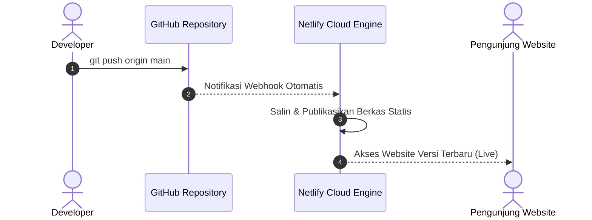

import { Steps } from '@astrojs/starlight/components';

Pada **Modul 3** ini, kita akan mempraktikkan proses deployment website statis ke platform cloud Netlify. Contoh proyek yang digunakan adalah aplikasi web kalkulator diskon yang terletak di direktori `sources/01-frontend-static/`.

---

## 1. Mengenal Karakteristik Website Statis

**Website Statis** adalah jenis website yang terdiri dari berkas-berkas siap pakai seperti HTML, CSS, JavaScript, serta media (gambar atau font). Berkas-berkas ini disajikan langsung ke browser pengunjung tanpa membutuhkan proses komputasi basis data (*database*) atau runtime server sisi belakang (*backend*) yang kompleks.

### Keunggulan Website Statis untuk Pemula:
- **Cepat dan Ringan**: Berkas dapat di-*cache* oleh jaringan CDN global sehingga halaman terbuka secara instan.
- **Hemat Biaya**: Dapat di-host secara gratis pada paket pemula Netlify dengan kuota yang sangat memadai.
- **Aman**: Karena tidak memiliki server database langsung, risiko celah keamanan server sangat minim.

### Struktur Berkas Proyek (`sources/01-frontend-static/`)

```text
sources/01-frontend-static/
├── index.html       # Struktur tampilan antarmuka Kalkulator Diskon
├── style.css        # Tata letak, warna, dan gaya visual halaman
├── script.js        # Logika perhitungan diskon di sisi browser (client-side)
├── netlify.toml     # Berkas konfigurasi deployment Netlify
└── README.md        # Panduan dan petunjuk proyek
```

---

## 2. Berkas Konfigurasi: `netlify.toml`

Netlify menggunakan berkas konfigurasi bernama `netlify.toml` yang diletakkan pada akar folder proyek. Untuk website statis murni tanpa alat *bundler* (seperti Vite atau Webpack), konfigurasinya sangat ringkas:

```toml
# netlify.toml
[build]
  publish = "."   # Folder yang dipublikasikan (titik berarti akar folder proyek)

[[headers]]
  for = "/*"
  [headers.values]
    X-Frame-Options = "DENY"
    X-Content-Type-Options = "nosniff"
```

Penjelasan konfigurasi:
- `publish = "."`: Memberitahu sistem Netlify bahwa berkas utama `index.html` berada langsung di akar folder proyek.
- `[[headers]]`: Menambahkan standar keamanan dasar pada setiap respons HTTP, seperti mencegah website Anda dimasukkan ke dalam frame situs lain (*anti-clickjacking*).

---

## 3. Cara 1: Deployment Menggunakan Netlify CLI (Terminal)

Netlify Command Line Interface (CLI) memungkinkan Anda menguji dan merilis website langsung dari aplikasi Terminal atau command prompt.

<Steps>
1. **Buka Terminal dan Masuk ke Direktori Proyek**:
   ```bash
   cd sources/01-frontend-static
   ```

2. **Login ke Akun Netlify**:
   ```bash
   npx netlify-cli login
   ```
   Browser Anda akan terbuka secara otomatis untuk meminta otentikasi akun. Setelah berhasil, kembali ke jendela terminal.

3. **Uji Website di Komputer Lokal (`netlify dev`)**:
   ```bash
   npx netlify-cli dev
   ```
   Perintah ini akan menjalankan server pengujian lokal di alamat `http://localhost:8888`. Buka browser untuk memastikan tampilan dan fungsi kalkulator berjalan normal. Tekan `Ctrl + C` di terminal untuk menghentikan server lokal.

4. **Deploy ke Lingkungan Draft / Preview**:
   ```bash
   npx netlify-cli deploy
   ```
   - Pilih opsi **Create & configure a new site**.
   - Masukkan nama tim (*Team*) dan tentukan nama situs yang diinginkan.
   - Ketika diminta mengisi *Publish directory*, masukkan titik (`.`).
   - Netlify akan menghasilkan tautan **Draft Preview** (contoh: `https://64a1b2c3--nama-situs.netlify.app`).

5. **Deploy ke Lingkungan Produksi (Live URL)**:
   Setelah meninjau tautan draft dan memastikan tidak ada kesalahan, jalankan perintah rilis resmi:
   ```bash
   npx netlify-cli deploy --prod
   ```
   Netlify akan memberikan **Live Production URL** (contoh: `https://nama-situs.netlify.app`) yang siap dibagikan ke publik.
</Steps>

---

## 4. Cara 2: Deployment Otomatis via Integrasi GitHub

Metode ini merupakan alur kerja yang paling direkomendasikan. Setiap kali Anda melakukan perubahan kode dan mengirimkannya (*push*) ke GitHub, Netlify akan memperbarui website secara otomatis.



<Steps>
1. **Unggah Proyek ke GitHub**:
   Jika belum diunggah, jalankan perintah Git berikut pada folder proyek:
   ```bash
   git init
   git add .
   git commit -m "feat: inisialisasi website statis kalkulator diskon"
   git branch -M main
   git remote add origin https://github.com/username-anda/kalkulator-diskon.git
   git push -u origin main
   ```

2. **Buka Dashboard Netlify**:
   - Kunjungi [app.netlify.com](https://app.netlify.com) dan login menggunakan akun GitHub Anda.
   - Klik tombol **Add new site**, lalu pilih **Import from an existing project**.

3. **Pilih Penyedia Git (GitHub)**:
   - Pilih provider **GitHub**.
   - Berikan izin akses ke repository `kalkulator-diskon` yang baru saja Anda buat.

4. **Atur Build Settings untuk Web Statis**:
   - **Branch to deploy**: `main`
   - **Build command**: Biarkan kosong (karena website statis murni tidak membutuhkan langkah kompilasi).
   - **Publish directory**: Isi dengan `.` (atau biarkan default membaca dari `netlify.toml`).

5. **Klik Tombol Deploy Site**:
   - Klik **Deploy site**. Dalam hitungan detik, website statis Anda sudah aktif dan dapat diakses di internet secara global.
</Steps>

---

## 5. Pengujian dan Verifikasi Hasil Deployment

Setelah mendapatkan URL resmi dari Netlify, lakukan langkah verifikasi berikut melalui browser:

1. **Pemeriksaan Enkripsi HTTPS**: Periksa apakah ikon gembok pada bilah alamat browser terkunci dengan aman (*Connection is secure*).
2. **Uji Fungsionalitas Kalkulator**:
   - Masukkan harga awal: `100000`.
   - Masukkan persentase diskon: `20`.
   - Klik tombol **Hitung Diskon**.
   - Pastikan rincian potongan (Rp 20.000) dan total pembayaran (Rp 80.000) tampil dengan benar.
3. **Pemeriksaan Console Browser**: Tekan tombol `F12` (Developer Tools) dan buka tab **Console**. Pastikan tidak terdapat pesan kesalahan berwarna merah.

---

## 6. Penyelesaian Masalah Umum (Troubleshooting)

:::caution[Kendala: Halaman 404 Page Not Found saat URL Dibuka]
- **Penyebab**: Netlify tidak menemukan berkas `index.html` pada direktori publish yang ditentukan.
- **Solusi**: Pastikan berkas utama bernama persis `index.html` (menggunakan huruf kecil semua) dan berada tepat pada direktori publish yang diatur pada `netlify.toml`.
:::

:::caution[Kendala: Tampilan Halaman Polos Tanpa CSS atau Script Tidak Jalan]
- **Penyebab**: Penggunaan tautan berkas absolut lokal (seperti `href="C:/Users/Nama/Desktop/style.css"`). Komputer server cloud tidak dapat mengakses jalur harddisk komputer pribadi Anda.
- **Solusi**: Gunakan jalur berkas relatif pada tag HTML, misalnya: `<link rel="stylesheet" href="style.css">` dan `<script src="script.js"></script>`.
:::

:::caution[Kendala: Berfungsi di Windows tapi 404 di Netlify]
- **Penyebab**: Sistem operasi Windows bersifat *case-insensitive* (tidak membedakan huruf besar dan kecil), sedangkan server Netlify berbasis Linux yang bersifat *case-sensitive*. Jika nama berkas adalah `Index.html`, server Linux tidak akan mengenalnya sebagai `index.html`.
- **Solusi**: Selalu gunakan huruf kecil untuk seluruh nama berkas website (`index.html`, `style.css`, `script.js`).
:::

---

## 7. Ringkasan Pembelajaran

Pada Modul 3 ini, Anda telah berhasil:
- Memahami struktur berkas dan keunggulan website statis tanpa ketergantungan server yang rumit.
- Mengonfigurasi `netlify.toml` untuk mengatur direktori publikasi dan header keamanan.
- Mempraktikkan dua alur rilis: Netlify CLI (pengujian cepat) dan integrasi GitHub (otomatisasi rilis berkelanjutan).
- Mengetahui langkah pengujian dan solusi kendala dasar deployment.

Pada **Modul 4**, kita akan mengukur dan menguji kualitas website yang telah kita rilis menggunakan **Google Lighthouse** untuk melakukan benchmark performa!
