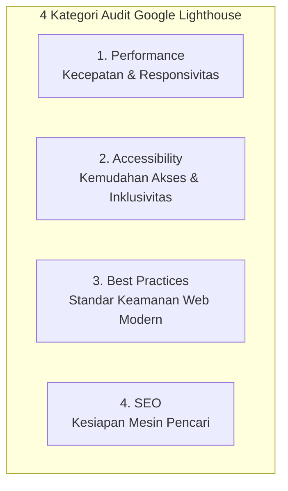
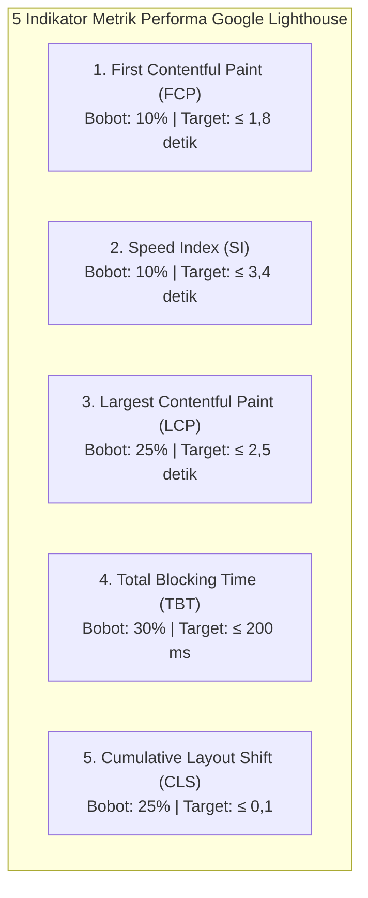
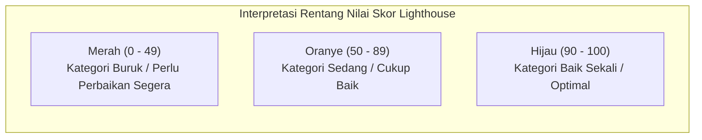

import { Steps } from '@astrojs/starlight/components';

Setelah website Anda berhasil dipublikasikan ke internet pada Modul 3, tahapan berikutnya yang sangat krusial adalah memastikan website tersebut dapat diakses dengan cepat, aman, ramah bagi semua kalangan, dan mudah ditemukan di mesin pencari.

Pada **Modul 4** ini, kita akan mempelajari cara melakukan **benchmark performa** menggunakan alat evaluasi resmi dari Google: **Google Lighthouse**.

---

## 1. Mengapa Performa Website Sangat Penting?

Ketika seseorang membuka website di ponsel atau komputer mereka, setiap detik waktu pemuatan (*loading time*) sangat menentukan keberhasilan website tersebut:

- **Kenyamanan Pengguna**: Pengguna internet cenderung segera meninggalkan website (*bounce*) jika halaman membutuhkan waktu lebih dari 3 detik untuk terbuka.
- **Keterbatasan Jaringan Seluler**: Pengunjung tidak selalu memiliki koneksi internet berkecepatan tinggi; website yang ringan dan teroptimasi tetap dapat diakses dengan lancar pada jaringan seluler 3G atau 4G.
- **Peringkat Mesin Pencari (Google SEO)**: Google secara resmi memprioritaskan website yang cepat, stabil, dan ramah pengguna ponsel dalam hasil pencarian.

**Benchmark Performa** adalah proses menguji dan mengukur kecepatan serta kualitas website menggunakan kumpulan indikator metrik terukur untuk mengetahui apakah website kita sudah optimal atau masih memiliki aspek yang perlu diperbaiki.

---

## 2. Mengenal Google Lighthouse

**Google Lighthouse** adalah alat audit otomatis sumber terbuka (*open-source*) yang dikembangkan oleh tim Google untuk mengevaluasi kualitas halaman web. Lighthouse tertanam langsung di dalam browser Google Chrome Developer Tools sehingga Anda dapat langsung menggunakannya tanpa perlu menginstal aplikasi tambahan apa pun.

Lighthouse mengevaluasi website berdasarkan **4 Kategori Skor Audit Utama**:

Setiap kategori akan dinilai dengan skor angka berskala **0 hingga 100**.

---

## 3. Penjelasan Mendalam 4 Kategori Audit Score

Mari kita bedah secara mendalam apa saja yang dinilai pada masing-masing kategori audit:

### A. Kategori 1: Performance (Performa Kecepatan & Responsivitas)

Kategori ini mengukur seberapa cepat website memuat seluruh konten visual, seberapa efisien browser mengeksekusi script, dan seberapa stabil tata letak antarmuka selama proses loading.

Pada Google Lighthouse versi terbaru, skor kategori **Performance** dihitung secara terukur berdasarkan **5 Indikator Metrik Utama** berikut beserta bobot persentasenya masing-masing:

| Indikator Metrik | Bobot Skor | Keterangan & Aspek yang Diukur | Target Kategori Baik (Hijau) |
| :--- | :---: | :--- | :--- |
| **First Contentful Paint (FCP)** | **10%** | Waktu saat browser pertama kali merender elemen konten visual apa pun (teks, gambar, atau elemen canvas) ke layar. Menandai bahwa halaman sedang aktif diproses. | **≤ 1,8 detik** |
| **Speed Index (SI)** | **10%** | Mengukur seberapa cepat konten visual pada halaman tampak terisi secara progresif selama pemuatan halaman (*perceptual visual loading speed*). | **≤ 3,4 detik** |
| **Largest Contentful Paint (LCP)** | **25%** | Waktu yang dibutuhkan browser untuk merender elemen konten visual terbesar yang terlihat di area pandang (*viewport*) pengguna (misalnya gambar banner hero atau blok judul utama). | **≤ 2,5 detik** |
| **Total Blocking Time (TBT)** | **30%** | Total durasi waktu antara FCP dan interaktivitas penuh saat thread utama (*main thread*) browser terblokir oleh pemrosesan JavaScript berat (>50 ms) sehingga respon klik/input terhambat. | **≤ 200 milidetik** |
| **Cumulative Layout Shift (CLS)** | **25%** | Mengukur kestabilan tata letak visual (*visual stability*), yaitu seberapa banyak elemen tiba-tiba bergeser posisi secara tak terduga selama proses loading (misalnya tombol terdorong ke bawah karena gambar baru selesai dimuat). | **≤ 0,1** |

> [!NOTE]
> Tiga metrik dengan bobot terbesar dalam penilaian performa Lighthouse adalah **Total Blocking Time (30%)**, **Largest Contentful Paint (25%)**, dan **Cumulative Layout Shift (25%)**. Ketiga metrik ini secara kumulatif berkontribusi sebesar 80% terhadap keseluruhan skor Performance.

**Faktor yang Sering Menurunkan Skor Performance**:
- Berkas gambar berukuran raksasa yang belum dikompresi (menurunkan skor LCP dan Speed Index).
- Elemen `` yang tidak menyertakan atribut `width` dan `height` (menurunkan skor CLS karena pergeseran layout mendadak).
- Terlalu banyak berkas JavaScript yang menghambat proses render halaman (*render-blocking resources*, menurunkan skor FCP dan TBT).

---

### B. Kategori 2: Accessibility (Aksesibilitas & Inklusivitas)

Kategori Accessibility mengukur seberapa ramah dan mudah website Anda digunakan oleh semua kalangan pengunjung, termasuk pengguna dengan disabilitas fisik (misalnya tunanetra atau buta warna) yang menggunakan perangkat pembaca layar (*screen reader*).

**Poin-Poin Utama yang Diperiksa oleh Lighthouse**:

1. **Kontras Warna Teks (*Color Contrast*)**:
   - Rasio perbedaan warna antara teks dan warna latar belakang (*background*) harus cukup tinggi agar mudah dibaca oleh pengguna dengan gangguan penglihatan (standar minimal rasio 4.5:1 untuk teks biasa).
2. **Atribut Teks Alternatif pada Gambar (`alt="..."`)**:
   - Setiap elemen `` wajib memiliki atribut `alt` yang mendeskripsikan isi gambar tersebut. Dengan begitu, *screen reader* dapat membacakan deskripsi gambar kepada pengguna tunanetra.
3. **Label Formulir Input (`<label for="...">`)**:
   - Setiap elemen input form (seperti kolom harga atau kolom diskon pada kalkulator) harus memiliki tag `<label>` yang terhubung secara jelas, bukan hanya memanfaatkan atribut placeholder.
4. **Hierarki Struktur Heading**:
   - Struktur judul harus teratur dan bertingkat secara logis (`<h1>` untuk judul utama halaman, diikuti `<h2>`, lalu `<h3>`), tidak boleh melompati tingkatan (misalnya langsung dari `<h1>` ke `<h4>`).
5. **Nama Elemen Interaktif (Tombol & Tautan)**:
   - Tombol dan link harus memiliki teks yang jelas (misalnya bertuliskan "Hitung Total Diskon", bukan tombol kosong tanpa label teks).

---

### C. Kategori 3: Best Practices (Standar Keamanan Web Modern)

Kategori Best Practices menguji apakah website Anda mematuhi standar terkini dalam hal keamanan data, keandalan arsitektur, dan kode web modern.

**Poin-Poin Utama yang Diperiksa oleh Lighthouse**:

1. **Penggunaan Protokol HTTPS secara Penuh**:
   - Memastikan seluruh komunikasi data terenkripsi dan bebas dari *Mixed Content* (kondisi di mana website HTTPS memuat gambar atau script dari alamat HTTP biasa yang tidak aman).
2. **Bebas Pesan Kesalahan di Browser Console**:
   - Saat halaman dibuka, tab Console Developer Tools tidak boleh mencatat adanya error JavaScript yang tidak tertangani (*uncaught exceptions*).
3. **Pustaka (*Library*) Kode yang Bebas Kerentanan**:
   - Memastikan website tidak menggunakan pustaka pihak ketiga versi usang yang telah diketahui memiliki celah keamanan publik (*known vulnerabilities*).
4. **Proporsi Rasio Aspek Gambar yang Tepat**:
   - Berkas gambar harus ditampilkan sesuai dengan aspek rasio aslinya (tidak tampak gepeng atau tertarik secara visual).

---

### D. Kategori 4: SEO (Search Engine Optimization / Kesiapan Mesin Pencari)

Kategori SEO mengevaluasi kelengkapan informasi dasar pada dokumen HTML agar halaman website dapat dirayapi (*crawled*) dan diindeks secara tepat oleh mesin pencari seperti Google, Bing, atau DuckDuckGo.

**Poin-Poin Utama yang Diperiksa oleh Lighthouse**:

1. **Judul Dokumen (`<title>`)**:
   - Dokumen HTML harus memiliki elemen `<title>` yang relevan, spesifik, dan tidak dibiarkan kosong.
2. **Meta Deskripsi Halaman (`<meta name="description" ...>`)**:
   - Terdapat ringkasan isi halaman sekitar 120–160 karakter yang akan dijadikan cuplikan teks (*snippet*) saat website muncul di halaman hasil pencarian Google.
3. **Konfigurasi Tampilan Ponsel (*Mobile Viewport*)**:
   - Halaman wajib menyertakan tag `<meta name="viewport" content="width=device-width, initial-scale=1.0">` di dalam bagian `<head>` agar tampilan website otomatis menyesuaikan lebar layar ponsel pengguna secara responsif.
4. **Teks Tautan yang Deskriptif**:
   - Teks pada tautan `<a>` harus menjelaskan tujuan halaman yang ditautkan (menghindari kata-kata ambigu seperti "klik di sini" atau "baca selengkapnya" tanpa konteks).
5. **Status Kode HTTP Sukses**:
   - Halaman berhasil memberikan respons kode status HTTP `200 OK` saat diakses oleh robot perayap (*crawler*) mesin pencari.

---

## 4. Cara Membaca dan Menginterpretasikan Skor Audit

Lighthouse menyajikan skor setiap kategori dalam bentuk lingkaran angka dengan kode warna universal:

- **Hijau (Skor 90 – 100)**: **Sangat Baik**. Website Anda telah memenuhi standar industri tertinggi pada kategori tersebut.
- **Oranye (Skor 50 – 89)**: **Cukup Baik**. Website berfungsi dengan baik, namun masih ada beberapa aspek yang dapat dioptimalkan.
- **Merah (Skor 0 – 49)**: **Perlu Perbaikan Segera**. Terdapat kendala signifikan yang dapat menurunkan kenyamanan pengunjung atau peringkat pencarian.

Di bawah ringkasan skor, Lighthouse menyediakan dua bagian analisis terperinci:
- **Opportunities (Peluang Penghematan)**: Daftar rekomendasi tindakan spesifik yang dapat Anda lakukan beserta estimasi jumlah detik atau kilobyte yang dapat dihemat.
- **Diagnostics (Laporan Diagnostik)**: Rincian teknis mengenai efisiensi pemrosesan script, struktur caching berkas, dan waktu eksekusi browser.

---

## 5. Langkah Praktik Menjalankan Audit Lighthouse

Berikut adalah panduan langkah demi langkah melakukan audit pada website Anda yang telah online di Netlify:

<Steps>
1. **Buka Google Chrome pada Jendela Penyamaran (Incognito Window)**:
   - Tekan `Ctrl + Shift + N` (Windows) atau `Cmd + Shift + N` (Mac).
   - *Penting*: Menggunakan jendela penyamaran sangat disarankan agar ekstensi browser yang terpasang di komputer Anda tidak ikut berjalan dan mendistorsi hasil pengukuran kecepatan.

2. **Buka URL Website Netlify Anda**:
   - Ketikkan alamat live website Anda (misalnya `https://kalkulator-diskon-budi.netlify.app`).

3. **Buka Panel Developer Tools**:
   - Tekan tombol **F12** pada keyboard atau klik kanan di area halaman web, lalu pilih **Inspect**.

4. **Pilih Tab Lighthouse**:
   - Klik tab **Lighthouse** pada bilah tab bagian atas. Jika tab tidak terlihat, klik ikon panah ganda (`>>`) untuk memunculkannya.

5. **Atur Pengaturan Pengujian**:
   - **Mode**: Navigation (Default).
   - **Device**: Pilih **Mobile** untuk menguji performa pada kondisi ponsel berkecepatan seluler rata-rata, atau **Desktop** untuk perangkat komputer.
   - **Categories**: Centang keempat kategori (*Performance*, *Accessibility*, *Best Practices*, *SEO*).

6. **Jalankan Proses Audit**:
   - Klik tombol **Analyze page load**.
   - Browser akan memuat ulang halaman secara otomatis selama 15 hingga 30 detik untuk mengukur responsivitas. Jangan menutup jendela browser hingga laporan audit lengkap ditampilkan di layar.
</Steps>

---

## 6. Tips Optimasi Performa untuk Website Statis

Untuk menjaga agar website statis Anda senantiasa mendapatkan skor hijau (90–100) di seluruh kategori:

1. **Optimasi Berkas Gambar**:
   - Gunakan format gambar modern seperti **WebP** atau **SVG** daripada JPEG/PNG berukuran megabyte.
   - Selalu cantumkan atribut `width` dan `height` pada tag `` untuk mencegah pergeseran layout (menjaga skor CLS tetap rendah).
2. **Minifikasi Berkas CSS dan JavaScript**:
   - Hapus spasi kosong, baris baru, dan komentar yang tidak diperlukan sebelum merilis website ke GitHub agar ukuran berkas yang diunduh browser pengunjung semakin kecil.
3. **Manfaatkan Keunggulan CDN Netlify**:
   - Netlify secara otomatis menyediakan kompresi data modern (**Brotli** dan **Gzip**) serta menyajikan berkas dari edge server terdekat dengan lokasi pengunjung.
4. **Lakukan Audit Berkala**:
   - Setiap kali Anda memperbarui tampilan atau menambah fungsionalitas baru, jalankan kembali audit Lighthouse untuk memastikan kualitas website tetap terjaga optimal.

---

## 7. Ringkasan Pembelajaran

Pada Modul 4 ini, Anda telah menguasai:
- Pentingnya benchmark performa dalam memastikan kenyamanan pengunjung dan reputasi website di internet.
- Pemahaman mendalam mengenai **4 Kategori Audit Google Lighthouse**: *Performance*, *Accessibility*, *Best Practices*, dan *SEO*.
- 5 Indikator metrik performa Google Lighthouse: **First Contentful Paint (FCP)**, **Speed Index (SI)**, **Largest Contentful Paint (LCP)**, **Total Blocking Time (TBT)**, dan **Cumulative Layout Shift (CLS)**.
- Cara menjalankan pengujian pada Google Chrome Incognito Window dan langkah membaca laporan skor audit secara tepat.
