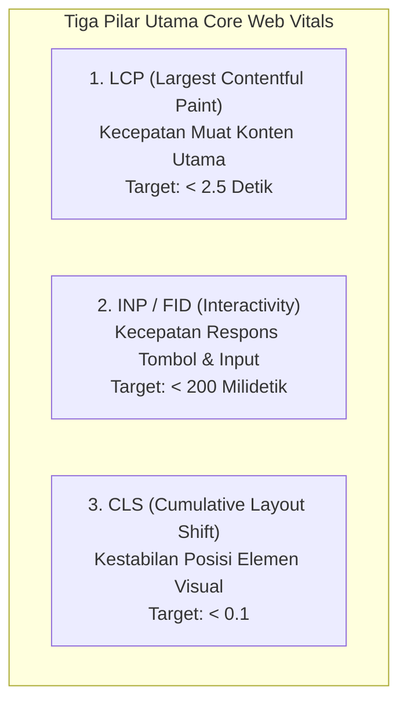

import { Steps } from '@astrojs/starlight/components';

Setelah website Anda berhasil dipublikasikan ke internet, tahapan berikutnya yang tidak kalah penting adalah memastikan website tersebut dapat diakses dengan cepat, stabil, dan nyaman oleh pengunjung. Pada **Modul 4** ini, kita akan mempelajari cara melakukan **benchmark performa** menggunakan alat evaluasi standar industri: **Google Lighthouse**.

---

## 1. Mengapa Performa Website Sangat Penting?

Ketika seseorang membuka website di ponsel atau komputer mereka, setiap detik waktu pemuatan (*loading time*) sangat menentukan:
- **Kenyamanan Pengguna**: Pengguna cenderung meninggalkan website (*bounce*) jika halaman membutuhkan waktu lebih dari 3 detik untuk terbuka.
- **Keterbatasan Jaringan**: Pengunjung tidak selalu memiliki koneksi internet berkecepatan tinggi; website yang ringan dapat diakses dengan lancar pada jaringan seluler 3G atau 4G.
- **Peringkat Pencarian (SEO)**: Mesin pencari seperti Google memberikan peringkat lebih tinggi pada website yang cepat dan ramah bagi pengguna ponsel.

**Benchmark Performa** adalah proses menguji dan mengukur kecepatan serta kualitas website menggunakan standar metrik terukur untuk mengetahui apakah website kita sudah optimal atau masih membutuhkan perbaikan.

---

## 2. Mengenal Google Lighthouse

**Google Lighthouse** adalah alat audit otomatis sumber terbuka (*open-source*) yang dikembangkan oleh Google untuk membantu pengembang meningkatkan kualitas halaman web. Lighthouse dapat langsung digunakan melalui browser Google Chrome tanpa perlu memasang aplikasi tambahan.

Lighthouse mengevaluasi website berdasarkan **4 kategori utama**:

| Kategori Audit | Aspek yang Dinilai | Target Ideal |
| :--- | :--- | :--- |
| **Performance** | Kecepatan pemuatan halaman, waktu respons terhadap interaksi, dan stabilitas tampilan visual. | Skor 90 - 100 |
| **Accessibility** | Kemudahan akses bagi seluruh kalangan pengguna, termasuk pengguna dengan keterbatasan penglihatan (kontras warna, atribut teks alternatif pada gambar). | Skor 90 - 100 |
| **Best Practices** | Kepatuhan terhadap standar keamanan web modern (penggunaan protokol HTTPS, keamanan pustaka kode). | Skor 90 - 100 |
| **SEO** | Kelengkapan informasi dasar halaman (seperti tag judul dan meta deskripsi) agar mudah dipahami oleh mesin pencari. | Skor 90 - 100 |

---

## 3. Memahami Metrik Kunci Core Web Vitals

Dalam kategori **Performance**, Google menggunakan sekumpulan metrik standar yang disebut **Core Web Vitals**. Tiga metrik utama yang wajib dipahami oleh pengembang pemula adalah:

### A. Largest Contentful Paint (LCP)
- **Definisi**: Waktu yang dibutuhkan browser untuk merender elemen konten terbesar di layar pengguna (biasanya berupa gambar utama, banner, atau blok teks judul).
- **Target**: Di bawah **2,5 detik** (kategori Baik).

### B. Interaction to Next Paint (INP) / First Input Delay (FID)
- **Definisi**: Durasi jeda antara saat pengguna mengeklik tombol atau mengetik pada form dengan saat browser benar-benar mulai memproses respons interaksi tersebut.
- **Target**: Di bawah **200 milidetik**.

### C. Cumulative Layout Shift (CLS)
- **Definisi**: Pengukuran tingkat pergeseran tata letak halaman yang tidak terduga saat konten sedang dimuat. Contohnya, saat Anda hendak mengeklik tautan, tiba-tiba posisinya bergeser ke bawah karena gambar baru saja selesai dimuat.
- **Target**: Skor di bawah **0,1**.

---

## 4. Langkah-Langkah Menjalankan Audit Lighthouse

Berikut adalah panduan praktik menjalankan audit performa pada website yang telah di-deploy ke Netlify:

<Steps>
1. **Buka Google Chrome pada Jendela Penyamaran (Incognito Window)**:
   Tekan `Ctrl + Shift + N` (Windows) atau `Cmd + Shift + N` (Mac). Pengujian pada jendela penyamaran sangat disarankan agar hasil skor tidak terpengaruh oleh ekstensi browser yang terpasang di komputer Anda.

2. **Buka URL Website Netlify Anda**:
   Masukkan tautan produksi website yang telah di-deploy pada Modul 3 (misalnya `https://nama-aplikasi.netlify.app`).

3. **Buka Panel Developer Tools**:
   Tekan tombol **F12** pada keyboard Anda atau klik kanan di mana saja pada halaman web, lalu pilih **Inspect**.

4. **Pilih Tab Lighthouse**:
   Pada deretan tab di bagian atas Developer Tools (Elements, Console, Sources, Network, ...), klik tab **Lighthouse**. Jika tidak terlihat, klik ikon panah ganda (`>>`) untuk menemukan tab Lighthouse.

5. **Konfigurasi Pengaturan Audit**:
   - **Mode**: Navigation (Default).
   - **Device**: Pilih **Mobile** untuk menguji performa pada perangkat ponsel berspesifikasi sedang, atau **Desktop** untuk perangkat komputer.
   - **Categories**: Centang seluruh kategori (*Performance*, *Accessibility*, *Best Practices*, *SEO*).

6. **Jalankan Audit**:
   Klik tombol **Analyze page load**. Biarkan browser memuat ulang halaman secara otomatis selama 15 hingga 30 detik sampai laporan hasil audit muncul di layar.
</Steps>

---

## 5. Cara Membaca dan Menginterpretasikan Skor

Lighthouse menampilkan skor akhir berupa lingkaran angka dengan kode warna:

- **Hijau (Skor 90 - 100)**: **Sangat Baik**. Halaman web telah memenuhi standar performa tinggi.
- **Oranye (Skor 50 - 89)**: **Cukup Baik**. Halaman berfungsi normal namun masih memiliki peluang untuk dioptimalkan.
- **Merah (Skor 0 - 49)**: **Perlu Perbaikan**. Pemuatan halaman terlalu lambat atau terdapat kendala teknis yang signifikan.

Di bawah lingkaran skor, perhatikan dua bagian penting:
- **Opportunities (Peluang Optimasi)**: Rekomendasi tindakan spesifik yang dapat menghemat waktu pemuatan berkas beserta perkiraan penghematan detiknya.
- **Diagnostics (Diagnostik)**: Informasi mendalam mengenai ukuran berkas aset, jumlah permintaan jaringan, dan efisiensi eksekusi script.

---

## 6. Tips Optimasi Performa untuk Website Statis

Bagi website statis murni seperti proyek kalkulator diskon kita, mencapai skor performa hijau (di atas 90) dapat dilakukan dengan langkah sederhana berikut:

1. **Optimasi Berkas Gambar**:
   - Jika website menggunakan gambar, kompres ukuran berkas gambar menggunakan format modern seperti **WebP** atau **SVG** daripada JPEG/PNG berukuran besar.
   - Cantumkan atribut `width` dan `height` pada setiap tag `` untuk mencegah pergeseran layout (menjaga skor CLS tetap rendah).

2. **Minifikasi Berkas CSS dan JavaScript**:
   - Hapus spasi kosong dan komentar yang tidak perlu pada berkas `style.css` dan `script.js` sebelum rilis produksi agar ukuran unduhan berkas menjadi lebih kecil.

3. **Keunggulan Alami Jaringan CDN Netlify**:
   - Netlify secara otomatis menyediakan kompresi berkas modern (**Brotli** dan **Gzip**) serta menyebarkan aset ke server CDN global terdekat dengan lokasi pengunjung. Hal ini secara signifikan mempercepat nilai FCP dan LCP.

4. **Lakukan Pengujian Berkala**:
   - Setiap kali Anda memperbarui fitur tampilan atau menambahkan pustaka baru, lakukan audit Lighthouse ulang untuk memastikan skor performa tidak mengalami penurunan.

---

## 7. Ringkasan Pembelajaran

Pada Modul 4 ini, Anda telah menguasai:
- Pentingnya benchmark performa dalam memastikan kualitas website di lingkungan produksi.
- Empat pilar audit Google Lighthouse: *Performance*, *Accessibility*, *Best Practices*, dan *SEO*.
- Indikator utama Core Web Vitals (LCP, INP/FID, CLS) dan target ideal masing-masing metrik.
- Cara menjalankan pengujian Lighthouse melalui Google Chrome Developer Tools.
- Langkah-langkah membaca skor serta tips optimasi aset website statis.
