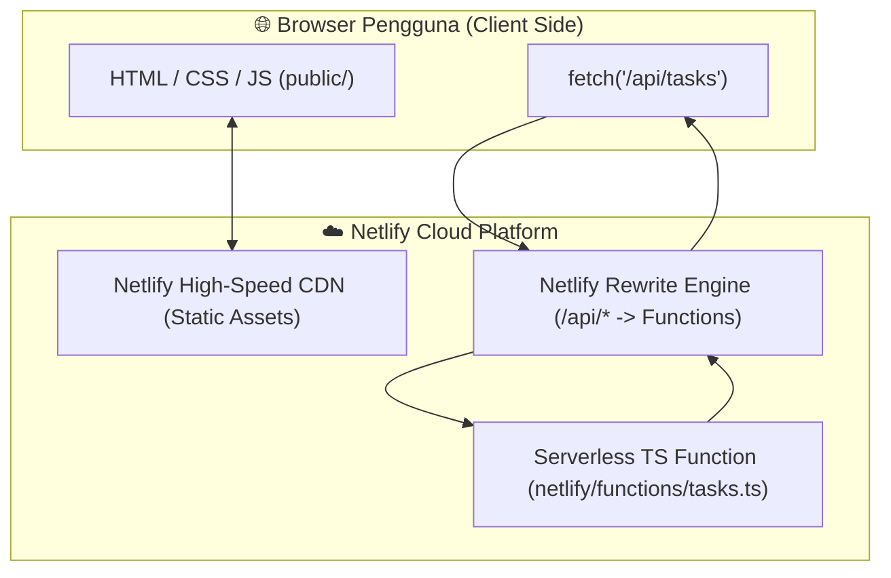

import { Steps, Tabs, TabItem } from '@astrojs/starlight/components';

Selamat datang di **Modul 4**! Ini adalah modul puncaknya, di mana kita akan menggabungkan semua pengetahuan dari modul sebelumnya untuk membangun dan me-deploy aplikasi **Fullstack Web (Task Manager)**. Kode sumber lengkap dapat ditemukan di folder `sources/03-fullstack/`.

---

## 1. Arsitektur Aplikasi Fullstack di Netlify

Dalam arsitektur modern Jamstack / Serverless di Netlify, frontend dan backend berada dalam satu proyek (*monorepo/unified repository*) namun dijalankan dengan peran masing-masing:



---

## 2. Struktur Source Code (`sources/03-fullstack`)

```text
sources/03-fullstack/
├── public/                # Direktori Frontend Statis yang dipublikasikan
│   ├── index.html         # Tampilan antarmuka Task Manager
│   ├── style.css          # Styling tema gelap (Dark Theme)
│   └── app.js             # Logika Fetch API ke backend
├── netlify/
│   └── functions/
│       └── tasks.ts       # Backend Serverless TS (GET, POST, DELETE /api/tasks)
├── netlify.toml           # Konfigurasi unified build & rewrite rules
├── package.json           # Ketergantungan backend
├── tsconfig.json          # Konfigurasi TypeScript
└── README.md
```

---

## 3. Komunikasi Client-Server & Penanganan CORS

 salah satu masalah umum yang sering dihadapi junior developer saat menghubungkan frontend dan backend di domain berbeda adalah **CORS (Cross-Origin Resource Sharing)**.

### Mengapa CORS Terjadi?
Jika frontend berada di `https://myfrontend.com` dan memanggil backend di `https://myapi.com`, browser akan memblokir permintaan tersebut demi alasan keamanan, kecuali backend secara eksplisit mengirimkan header `Access-Control-Allow-Origin`.

### Solusi Netlify: URL Rewrites (Proxy)

Dengan menggunakan `netlify.toml`, kita bisa membuat frontend dan backend seolah-olah berada di **domain yang sama**:

```toml
# netlify.toml
[build]
  publish = "public"            # Folder aset statis
  functions = "netlify/functions" # Folder fungsi serverless

# Meneruskan semua request dari /api/* ke Netlify Functions secara internal
[[redirects]]
  from = "/api/*"
  to = "/.netlify/functions/:splat"
  status = 200                  # HTTP 200 berarti REWRITE (bukan redirect 301)
```

Dengan konfigurasi `status = 200` ini:
1. Di kode frontend `app.js`, kita cukup memanggil path relatif: `fetch('/api/tasks')`.
2. Browser menganggap request dikirim ke domain yang sama.
3. **Isu CORS terhindari sepenuhnya!**

---

## 4. Bedah Kode Backend: `netlify/functions/tasks.ts`

Backend ini mendukung operasi **CRUD (Create, Read, Delete)** berbasis REST API:

```typescript
import type { Context } from "@netlify/functions";

interface Task {
  id: string;
  text: string;
  createdAt: string;
}

let tasksStore: Task[] = [
  { id: "1", text: "Belajar konsep deployment web", createdAt: new Date().toISOString() },
  { id: "2", text: "Deploy frontend statis ke Netlify", createdAt: new Date().toISOString() }
];

export default async (req: Request, context: Context) => {
  const method = req.method;
  const url = new URL(req.url);

  const headers = {
    "Content-Type": "application/json",
    "Access-Control-Allow-Origin": "*",
    "Access-Control-Allow-Headers": "Content-Type",
    "Access-Control-Allow-Methods": "GET, POST, DELETE, OPTIONS"
  };

  // Response Preflight Request untuk OPTIONS
  if (method === "OPTIONS") {
    return new Response(null, { status: 204, headers });
  }

  // GET /api/tasks -> Ambil daftar tugas
  if (method === "GET") {
    return new Response(JSON.stringify(tasksStore), { status: 200, headers });
  }

  // POST /api/tasks -> Tambah tugas baru
  if (method === "POST") {
    const body = await req.json();
    const newTask: Task = {
      id: Date.now().toString(),
      text: body.text,
      createdAt: new Date().toISOString()
    };
    tasksStore.push(newTask);
    return new Response(JSON.stringify(newTask), { status: 201, headers });
  }

  // DELETE /api/tasks?id=123 -> Hapus tugas
  if (method === "DELETE") {
    const id = url.searchParams.get("id");
    tasksStore = tasksStore.filter(t => t.id !== id);
    return new Response(JSON.stringify({ message: "Berhasil dihapus" }), { status: 200, headers });
  }

  return new Response(JSON.stringify({ error: "Method not allowed" }), { status: 405, headers });
};
```

---

## 5. Bedah Kode Frontend: `public/app.js`

Frontend memanggil endpoint `/api/tasks` secara asinkron menggunakan JavaScript `fetch`:

```javascript
const API_URL = '/api/tasks';

// 1. Mengambil data dari Backend saat halaman dimuat
async function fetchTasks() {
  const res = await fetch(API_URL);
  const tasks = await res.json();
  renderTasks(tasks);
}

// 2. Mengirim data tugas baru ke Backend (POST)
taskForm.addEventListener('submit', async (e) => {
  e.preventDefault();
  await fetch(API_URL, {
    method: 'POST',
    headers: { 'Content-Type': 'application/json' },
    body: JSON.stringify({ text: taskInput.value })
  });
  fetchTasks();
});

// 3. Menghapus tugas dari Backend (DELETE)
async function deleteTask(id) {
  await fetch(`${API_URL}?id=${id}`, { method: 'DELETE' });
  fetchTasks();
}
```

---

## 6. Uji Coba & Deployment Aplikasi Fullstack

<Steps>
1. **Masuk ke folder proyek fullstack**:
   ```bash
   cd sources/03-fullstack
   npm install
   ```

2. **Jalankan lingkungan pengujian lokal**:
   ```bash
   npx netlify-cli dev
   ```
   Netlify CLI akan membuka aplikasi di `http://localhost:8888`.
   - Buka browser dan coba tambahkan beberapa tugas baru.
   - Buka tab **Network** di Developer Tools (F12) untuk melihat request `POST /api/tasks` yang berhasil mengembalikan HTTP status `201 Created`.

3. **Deploy ke Production**:
   ```bash
   npx netlify-cli deploy --prod
   ```
</Steps>

---

## 7. Troubleshooting Aplikasi Fullstack

:::warning[Masalah: Frontend menampilkan error "Failed to fetch" saat menambah tugas?]
**Penyebab**: Netlify function mengalami error internal saat parsing JSON atau status response bukan 2xx.
**Solusi**: Periksa tab Network di browser -> klik request `/api/tasks` -> lihat tab **Response** & **Preview** untuk mengetahui detail pesan kesalahan dari serverless function.
:::

:::warning[Masalah: Data hilang setelah beberapa menit?]
**Penyebab**: Netlify Functions menggunakan *in-memory storage* yang bersifat sementara. Ketika fungsi *idle* (sepi pemanggil), serverless instance akan dimatikan dan variabel memori di-reset.
**Solusi**: Untuk aplikasi produksi nyata, hubungkan Netlify Functions dengan database cloud eksternal seperti Supabase (PostgreSQL), MongoDB Atlas, atau PlanetScale (MySQL).
:::

---

## Ringkasan Pembelajaran Fullstack

Selamat! Anda telah menguasai keseluruhan alur **Deployment Web Application di Netlify**:
1. **Modul 1**: Memahami landasan teori deployment, local vs production, dan SSL/DNS.
2. **Modul 2**: Menyebarkan frontend statis menggunakan CLI dan GitHub.
3. **Modul 3**: Membangun serverless backend TypeScript yang aman dengan Environment Variables.
4. **Modul 4**: Menyinergikan frontend & backend secara penuh tanpa masalah CORS menggunakan Netlify Rewrites.

Jangan lupa untuk membaca **Cheatsheet Perintah CLI & Tips Troubleshooting** di halaman berikutnya sebagai referensi cepat pekerjaan Anda sehari-hari!
