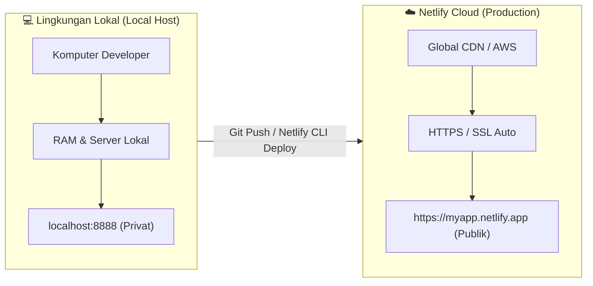
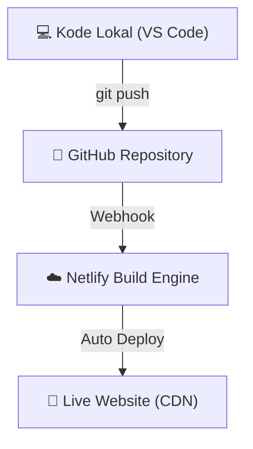

# Modul 1
## Konsep Dasar Deployment

Memahami apa itu deployment, perbedaan antara lingkungan Local vs Production, serta arsitektur cloud modern untuk developer junior.

---
layout: default
---

# 1. Apa Itu Deployment?

**Deployment** (Penggelaran / Penyebaran) adalah proses memindahkan aplikasi web yang telah selesai dibuat di komputer lokal (*Local Environment*) ke server cloud publik (*Production Environment*) sehingga dapat diakses melalui internet.

### Mengapa Kita Membutuhkan Deployment?

Ketika Anda menjalankan aplikasi di komputer sendiri (`localhost:3000` atau `localhost:8888`), aplikasi tersebut **hanya bisa diakses oleh komputer Anda sendiri**. Pengguna internet lain tidak memiliki akses ke harddisk atau jaringan komputer lokal Anda.

  
💡 Analogi Sederhana

  

    Menulis kode di komputer lokal diibaratkan seperti <b>mengarang buku di buku catatan pribadi Anda</b>. 
    Deployment adalah proses <b>mencetak buku tersebut dan meletakkannya di rak toko buku publik</b> agar siapa saja dapat membacanya.
  

---
layout: default
---

# 2. Perbedaan Lingkungan: Local vs Production

Dalam dunia pengembangan perangkat lunak (*software development*), terdapat pemisahan lingkungan (*environment*) kerja:

 Alur perpindahan kode dari komputer pengembang menuju platform hosting cloud publik

---
layout: default
---

# 2. Perbedaan Local vs Production (Tabel)

| Fitur / Karakteristik | Lingkungan Lokal (*Local Environment*) | Lingkungan Produksi (*Production Environment*) |
| :--- | :--- | :--- |
| **Alamat URL** | `http://localhost:3000` atau `127.0.0.1` | `https://aplikasiku.netlify.app` / custom domain |
| **Aksesibilitas** | Hanya komputer Anda sendiri | Publik (Siapa saja yang terkoneksi internet) |
| **Keamanan (SSL)** | `http://` tanpa enkripsi | `https://` dengan sertifikat SSL aktif |
| **Database & API** | Database tiruan/lokal (`localhost:5432`) | Database cloud terenkripsi & skala besar |
| **Variabel Rahasia** | File `.env` lokal | Netlify Dashboard Environment Variables |
| **Toleransi Error** | Error ditampilkan lengkap di layar browser | Error disembunyikan untuk keamanan pengguna |

---
layout: default
---

# 3. Komponen Utama Aplikasi Web di Cloud

  
A. Web Hosting / Server Cloud

  

    Tempat penyimpanan file HTML, CSS, JS, dan kode backend agar dapat dieksekusi 24/7. Netlify menggunakan <b>CDN (Content Delivery Network)</b> global untuk menduplikasi file ke puluhan server di seluruh dunia.
  

  
B. Nama Domain & DNS

  

    • <b>IP Address</b>: Alamat numerik server (contoh: <code>75.2.60.5</code>). 
    • <b>Domain Name</b>: Nama mudah diingat (<code>google.com</code> atau <code>my-app.netlify.app</code>). 
    • <b>DNS</b>: Buku telepon internet yang menerjemahkan Domain ke IP Address.
  

  
C. SSL / HTTPS Certificate

  

    Enkripsi keamanan berikon gembok di browser. Memastikan data pengguna (password, data sensitif) tidak diintip pihak ketiga. Netlify memberikan <b>SSL Gratis (Let's Encrypt)</b> otomatis!
  

  
D. Environment Variables

  

    Tempat menyimpan kunci rahasia (<i>API Key</i>, <i>Database URL</i>, <i>Secret Key</i>) agar tidak ditulis langsung di dalam source code (<i>hardcoded</i>).
  

  ⚠️ Penting untuk Keamanan: Jangan pernah mengunggah file <code>.env</code> atau <i>Secret API Key</i> ke repository GitHub publik! Selalu gunakan menu <i>Environment Variables</i> di platform hosting.

---
layout: default
---

# 4. Alur Kerja Otomatisasi (CI/CD)

Netlify mendukung alur kerja modern **Continuous Integration & Continuous Deployment (CI/CD)**:

  <ol class="space-y-2 text-xs">
    <li>Developer Menulis Kode di VS Code lokal.</li>
    <li>Commit & Push kode ke GitHub repository.</li>
    <li>Netlify Mendeteksi perubahan otomatis via Webhook.</li>
    <li>Process Build dijalankan di cloud Netlify.</li>
    <li>Aplikasi Ter-update secara otomatis tanpa downtime!</li>
  </ol>

---
layout: default
---

# 💡 Ringkasan Modul 1

  <carbon:checkmark-filled class="text-emerald-600 dark:text-emerald-400" />
  <b>Pengertian Deployment:</b> Memindahkan aplikasi dari komputer lokal ke server cloud publik.

  <carbon:checkmark-filled class="text-emerald-600 dark:text-emerald-400" />
  <b>Local vs Production:</b> Privasi <code>localhost</code> vs Keamanan & Aksesibilitas Publik Cloud.

  <carbon:checkmark-filled class="text-emerald-600 dark:text-emerald-400" />
  <b>Komponen Cloud:</b> CDN Hosting, Domain/DNS, SSL HTTPS Gratis, dan Environment Variables.

  <carbon:checkmark-filled class="text-emerald-600 dark:text-emerald-400" />
  <b>Otomatisasi CI/CD:</b> Perubahan di GitHub langsung ter-deploy otomatis ke Netlify CDN.

  Selanjutnya di Modul 2 ➔ Deploy Frontend Statis (Vanilla HTML/CSS/JS) ke Netlify!

