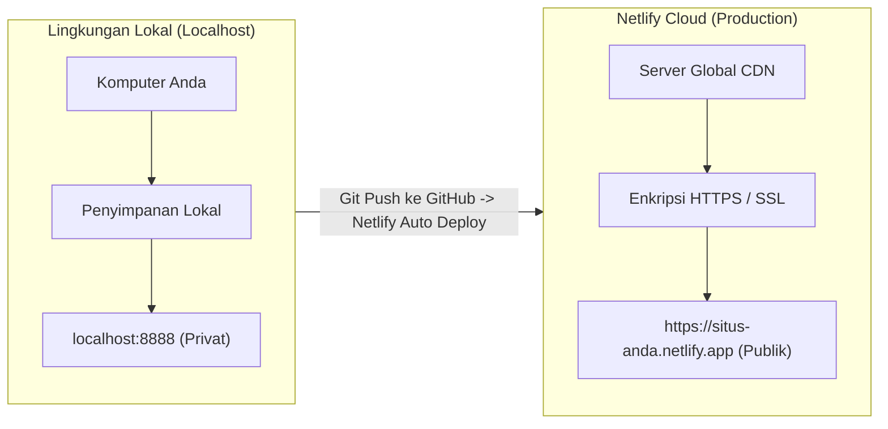
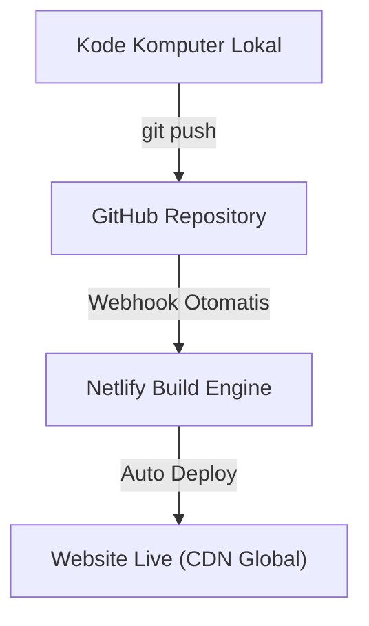

# Modul 1
## Konsep Dasar Deployment

Memahami konsep dasar deployment, evolusi dari traditional VPS ke modern CI/CD dan serverless, serta arsitektur cloud untuk pemula.

---
layout: default
---

# 1. Pengertian Deployment

**Deployment** adalah proses memindahkan atau merilis aplikasi web dari komputer lokal (*Local Environment*) ke server cloud publik (*Production Environment*) sehingga dapat diakses oleh siapa saja melalui internet.

### Mengapa Deployment Diperlukan?

Ketika Anda menjalankan website di komputer sendiri (`localhost:3000` atau `localhost:8888`), website tersebut **hanya bisa dibuka oleh komputer Anda sendiri**. Pengguna internet di luar tidak memiliki izin atau akses ke penyimpanan komputer pribadi Anda.

  
Analogi Sederhana

  

    Menulis kode di komputer lokal diibaratkan seperti <b>menulis catatan pada buku harian pribadi</b>. 
    Deployment adalah proses <b>mencetak tulisan tersebut dan menaruhnya di rak perpustakaan publik</b> agar dapat dibaca oleh masyarakat umum.
  

---
layout: default
---

# 2. Evolusi Deployment: Tradisional vs Modern

Bagaimana cara pengembang web merilis website ke internet dari masa ke masa?

  
A. Traditional Deployment (VPS)

  <ul class="space-y-1.5 opacity-90 leading-relaxed">
    <li>• Sewa VPS (Ubuntu Linux) dengan biaya bulanan tetap.</li>
    <li>• Akses server manual via terminal <b>SSH</b> atau <b>FTP/SFTP</b>.</li>
    <li>• Instal & konfigurasi manual web server <b>Nginx / Apache</b>.</li>
    <li>• Pasang & perpanjang sertifikat SSL manual (Certbot).</li>
    <li>• Risiko crash / downtime saat lonjakan trafik pengunjung.</li>
  </ul>

  
B. Modern Deployment (CI/CD & Serverless)

  <ul class="space-y-1.5 opacity-90 leading-relaxed">
    <li>• <b>Otomatisasi CI/CD:</b> Cukup <code>git push</code> ke GitHub, website langsung ter-update di cloud.</li>
    <li>• <b>Serverless & Global CDN:</b> Berkas disalin ke puluhan server edge di seluruh dunia tanpa mengurus OS.</li>
    <li>• <b>Auto-scaling:</b> Menangani ribuan trafik tanpa downtime.</li>
    <li>• <b>SSL Otomatis:</b> Enkripsi HTTPS aktif gratis seketika.</li>
  </ul>

---
layout: default
---

# 2. Tabel Perbandingan VPS vs Serverless CI/CD

| Aspek | Traditional Deployment (VPS) | Modern Deployment (Netlify / Serverless) |
| :--- | :--- | :--- |
| **Pengelolaan Server** | Manual (Konfigurasi OS, Nginx, Firewall) | Dikelola penuh oleh platform cloud (*Zero Server Ops*) |
| **Alur Rilis Kode** | Manual via SSH, FTP, atau Git pull di VPS | Otomatis terpicu saat melakukan `git push` ke GitHub |
| **Sertifikat SSL** | Dikonfigurasi dan diperpanjang manual | Otomatis aktif (*Let's Encrypt*) secara gratis |
| **Distribusi Berkas** | Terpusat pada satu lokasi server VPS | Tersebar di puluhan server **Global CDN** di seluruh dunia |
| **Ketahanan Trafik** | Terbatas pada kapasitas RAM/CPU VPS | Skala otomatis (*Auto-scaling*) tanpa risiko server down |
| **Tingkat Kesulitan** | Butuh keahlian Linux & DevOps | Sangat ramah pemula, cukup menghubungkan GitHub |

---
layout: default
---

# 3. Perbedaan Lingkungan: Local vs Production

| Karakteristik | Lingkungan Lokal (*Localhost*) | Lingkungan Produksi (*Cloud*) |
| :--- | :--- | :--- |
| **Alamat URL** | `http://localhost:3000` atau `127.0.0.1` | `https://situs-anda.netlify.app` / custom domain |
| **Aksesibilitas** | Hanya komputer Anda sendiri | Publik (seluruh pengguna internet) |
| **Keamanan** | `http://` tanpa enkripsi | `https://` dengan sertifikat SSL aktif |
| **Error Handling** | Pesan error ditampilkan lengkap untuk debugging | Pesan internal disembunyikan demi keamanan |

---
layout: default
---

# 4. Komponen Utama Infrastruktur Web Cloud

  
A. Web Hosting & CDN

  

    • <b>Hosting:</b> Komputer cloud penyimpan berkas web 24/7. 
    • <b>CDN (Content Delivery Network):</b> Jaringan server global yang menduplikasi berkas agar dimuat cepat dari lokasi terdekat.
  

  
B. Nama Domain & DNS

  

    • <b>IP Address:</b> Alamat numerik server (contoh: <code>75.2.60.5</code>). 
    • <b>Domain:</b> Nama alamat web yang mudah diingat manusia. 
    • <b>DNS:</b> Buku kontak internet yang menerjemahkan Domain ke IP.
  

  
C. Protokol HTTPS & Sertifikat SSL

  

    Protokol transfer data terenkripsi berikon gembok di browser. Menjamin data pengunjung tidak disadap di jaringan. Netlify memberikan <b>Sertifikat SSL Gratis (Let's Encrypt)</b> secara otomatis pada setiap website yang di-deploy!
  

---
layout: default
---

# 5. Alur Kerja Otomatisasi (CI/CD)

Netlify mendukung alur kerja modern **Continuous Integration & Continuous Deployment (CI/CD)**:

  <ol class="space-y-2 text-xs">
    <li>1. Menulis Kode: Mengembangkan website di VS Code komputer lokal.</li>
    <li>2. Commit & Push: Mengunggah pembaruan kode ke repositori GitHub.</li>
    <li>3. Notifikasi Webhook: GitHub memberi tahu Netlify saat ada perubahan kode baru.</li>
    <li>4. Publikasi Global: Netlify mendistribusikan berkas ke jaringan CDN.</li>
    <li>5. Website Ter-update: Live otomatis tanpa jeda (*zero downtime*).</li>
  </ol>

---
layout: default
---

# Ringkasan Modul 1

  <carbon:checkmark-filled class="text-emerald-600 dark:text-emerald-400" />
  <b>Pengertian Deployment:</b> Memindahkan aplikasi dari komputer lokal ke server cloud publik.

  <carbon:checkmark-filled class="text-emerald-600 dark:text-emerald-400" />
  <b>Tradisional vs Modern:</b> Kerumitan mengurus VPS manual vs kemudahan otomatisasi Serverless & CI/CD.

  <carbon:checkmark-filled class="text-emerald-600 dark:text-emerald-400" />
  <b>Infrastruktur Cloud:</b> CDN untuk kecepatan akses, DNS untuk penerjemah domain, dan SSL untuk enkripsi HTTPS.

  <carbon:checkmark-filled class="text-emerald-600 dark:text-emerald-400" />
  <b>Alur CI/CD:</b> Perubahan kode di GitHub secara otomatis memicu pembaruan website di Netlify.

  Selanjutnya di Modul 2 ➔ Penggunaan Git dan GitHub untuk Pengembang Pemula!

