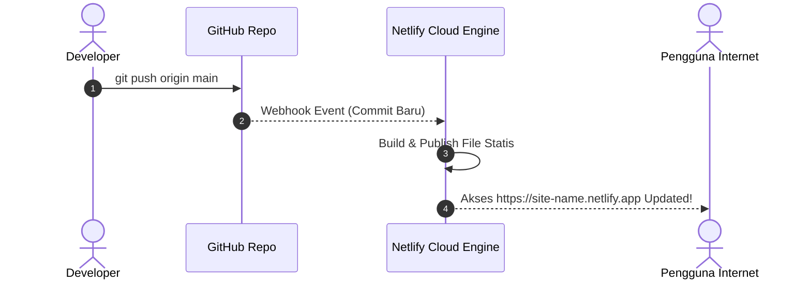

# Modul 2
## Deploy Frontend Statis (Web Only)

Panduan langkah demi langkah me-deploy web statis Vanilla HTML, CSS, dan JavaScript ke Netlify menggunakan Netlify CLI dan GitHub Integration.

---
layout: default
---

# 1. Mengenal Aplikasi Web Statis

**Aplikasi Web Statis** adalah web yang terdiri dari berkas-berkas HTML, CSS, JavaScript, dan media yang disajikan langsung ke browser pengguna tanpa memerlukan proses komputasi server berat.

### Struktur Source Code (`sources/01-frontend-static`)

<div class="grid grid-cols-2 gap-4 mt-4">

<div class="p-4 rounded-lg bg-slate-100 dark:bg-slate-800/80 border border-slate-200 dark:border-slate-700 font-mono text-xs space-y-2">
  <div class="font-bold text-cyan-700 dark:text-cyan-400">sources/01-frontend-static/</div>
  <div>├── index.html       <span class="opacity-60"># Interface Kalkulator Diskon</span></div>
  <div>├── style.css        <span class="opacity-60"># Layout & visual design</span></div>
  <div>├── script.js        <span class="opacity-60"># Logika kalkulasi browser</span></div>
  <div>├── netlify.toml     <span class="opacity-60"># Konfigurasi deployment</span></div>
  <div>└── README.md        <span class="opacity-60"># Ringkasan instruksi</span></div>
</div>

<div class="p-4 rounded-lg bg-blue-50 dark:bg-blue-950/40 border border-blue-200 dark:border-blue-800/50 text-blue-950 dark:text-blue-100 text-xs leading-relaxed">
  <div class="font-bold text-blue-700 dark:text-blue-400 mb-2">📌 Karakteristik Utama Web Statis:</div>
  • Tidak memerlukan Node.js runtime di sisi server.<br>
  • Sangat cepat karena di-cache secara agresif oleh <b>CDN</b>.<br>
  • Biaya hosting gratis/sangat murah.<br>
  • Keamanan tinggi (tidak ada serangan database server langsung).
</div>

</div>

---
layout: default
---

# 2. File Konfigurasi: `netlify.toml`

`netlify.toml` adalah file konfigurasi utama yang dibaca Netlify saat membangun aplikasi Anda. 

```toml [netlify.toml]
# netlify.toml - Konfigurasi Web Statis
[build]
  publish = "."   # Direktori yang akan dipublikasikan (akar folder)

[[headers]]
  for = "/*"
  [headers.values]
    X-Frame-Options = "DENY"
    X-Content-Type-Options = "nosniff"
```

<div class="mt-4 p-3 rounded-lg bg-slate-100 dark:bg-slate-800 border border-slate-200 dark:border-slate-700 text-xs">
  • <code>publish = "."</code>: Memberi tahu Netlify bahwa berkas <code>index.html</code> berada di direktori utama.<br>
  • <code>[[headers]]</code>: Menambahkan header keamanan dasar pada semua respon HTTP.
</div>

---
layout: default
---

# 3. Cara 1: Deployment Menggunakan Netlify CLI

Netlify CLI memungkinkan Anda melakukan deployment langsung dari terminal komputer:

<div class="space-y-2 mt-2 text-xs">

<div class="flex items-start space-x-3">
  <div class="bg-cyan-100 dark:bg-cyan-950 text-cyan-800 dark:text-cyan-300 font-bold px-2 py-1 rounded">Langkah 1</div>
  <div>
    <b>Masuk ke folder proyek:</b>
    <code class="block mt-1 bg-slate-100 dark:bg-slate-900 px-2 py-1 rounded text-cyan-700 dark:text-cyan-300 border border-slate-200 dark:border-slate-800">cd sources/01-frontend-static</code>
  </div>
</div>

<div class="flex items-start space-x-3">
  <div class="bg-cyan-100 dark:bg-cyan-950 text-cyan-800 dark:text-cyan-300 font-bold px-2 py-1 rounded">Langkah 2</div>
  <div>
    <b>Login ke Akun Netlify Anda:</b>
    <code class="block mt-1 bg-slate-100 dark:bg-slate-900 px-2 py-1 rounded text-cyan-700 dark:text-cyan-300 border border-slate-200 dark:border-slate-800">npx netlify-cli login</code>
  </div>
</div>

<div class="flex items-start space-x-3">
  <div class="bg-cyan-100 dark:bg-cyan-950 text-cyan-800 dark:text-cyan-300 font-bold px-2 py-1 rounded">Langkah 3</div>
  <div>
    <b>Uji Aplikasi secara Lokal (<code>http://localhost:8888</code>):</b>
    <code class="block mt-1 bg-slate-100 dark:bg-slate-900 px-2 py-1 rounded text-cyan-700 dark:text-cyan-300 border border-slate-200 dark:border-slate-800">npx netlify-cli dev</code>
  </div>
</div>

<div class="flex items-start space-x-3">
  <div class="bg-cyan-100 dark:bg-cyan-950 text-cyan-800 dark:text-cyan-300 font-bold px-2 py-1 rounded">Langkah 4</div>
  <div>
    <b>Deploy ke Draft / Preview Environment:</b>
    <code class="block mt-1 bg-slate-100 dark:bg-slate-900 px-2 py-1 rounded text-cyan-700 dark:text-cyan-300 border border-slate-200 dark:border-slate-800">npx netlify-cli deploy</code>
    <span class="opacity-75">Pilih 'Create & configure a new site', masukkan <code>.</code> untuk publish directory.</span>
  </div>
</div>

<div class="flex items-start space-x-3">
  <div class="bg-emerald-100 dark:bg-emerald-950 text-emerald-800 dark:text-emerald-300 font-bold px-2 py-1 rounded">Langkah 5</div>
  <div>
    <b>Deploy ke Production Environment (Live URL):</b>
    <code class="block mt-1 bg-slate-100 dark:bg-slate-900 px-2 py-1 rounded text-emerald-700 dark:text-emerald-300 border border-slate-200 dark:border-slate-800">npx netlify-cli deploy --prod</code>
  </div>
</div>

</div>

---
layout: default
---

# 4. Cara 2: Deployment Otomatis via GitHub Integration

Metode ini adalah *best-practice* industri software engineering:



---
layout: default
---

# 4. Langkah Integrasi GitHub di Netlify

<ol class="space-y-2 text-xs mt-2">
  <li class="p-2 rounded bg-slate-100 dark:bg-slate-800/80 border border-slate-200 dark:border-slate-700">
    <span class="font-bold text-cyan-700 dark:text-cyan-400">Push Kode ke GitHub:</span>
    <pre class="bg-slate-200 dark:bg-slate-900 p-2 rounded mt-1 text-cyan-800 dark:text-cyan-300 font-mono">git init && git add . && git commit -m "feat: initial commit web statis"
git branch -M main
git remote add origin https://github.com/username/frontend-statis-demo.git
git push -u origin main</pre>
  </li>

  <li class="p-2 rounded bg-slate-100 dark:bg-slate-800/80 border border-slate-200 dark:border-slate-700">
    <span class="font-bold text-cyan-700 dark:text-cyan-400">Buka Netlify Dashboard:</span> Masuk ke <a href="https://app.netlify.com" target="_blank" class="text-cyan-600 dark:text-cyan-400 underline">app.netlify.com</a> ➔ Klik <b>Add new site</b> ➔ <b>Import from an existing project</b>.
  </li>

  <li class="p-2 rounded bg-slate-100 dark:bg-slate-800/80 border border-slate-200 dark:border-slate-700">
    <span class="font-bold text-cyan-700 dark:text-cyan-400">Hubungkan GitHub & Pilih Repository:</span> Pilih provider <b>GitHub</b> dan berikan otorisasi ke repository <code>frontend-statis-demo</code>.
  </li>

  <li class="p-2 rounded bg-slate-100 dark:bg-slate-800/80 border border-slate-200 dark:border-slate-700">
    <span class="font-bold text-cyan-700 dark:text-cyan-400">Configure Build Settings:</span> Branch = <code>main</code>, Build command = (kosongkan), Publish directory = <code>.</code>.
  </li>

  <li class="p-2 rounded bg-slate-100 dark:bg-slate-800/80 border border-slate-200 dark:border-slate-700">
    <span class="font-bold text-emerald-700 dark:text-emerald-400">Deploy Site:</span> Klik <b>Deploy site</b>. Dalam hitungan detik situs web Anda sudah Live!
  </li>
</ol>

---
layout: default
---

# 5. Pengujian & Verifikasi Deployment

Buka URL produksi yang diberikan Netlify di browser Anda:

<div class="grid grid-cols-3 gap-4 mt-6">

<div class="p-4 rounded-lg bg-slate-100 dark:bg-slate-800 border border-slate-200 dark:border-slate-700 text-center">
  <div class="text-3xl mb-2">🔒</div>
  <div class="font-bold text-emerald-700 dark:text-emerald-400 text-sm">1. Enkripsi HTTPS</div>
  <div class="text-xs opacity-80 mt-1">Pastikan ikon gembok HTTPS aktif di address bar browser.</div>
</div>

<div class="p-4 rounded-lg bg-slate-100 dark:bg-slate-800 border border-slate-200 dark:border-slate-700 text-center">
  <div class="text-3xl mb-2">🧮</div>
  <div class="font-bold text-cyan-700 dark:text-cyan-400 text-sm">2. Form Kalkulator</div>
  <div class="text-xs opacity-80 mt-1">Input harga: <code>100000</code> dan diskon: <code>25</code>. Klik tombol Hitung.</div>
</div>

<div class="p-4 rounded-lg bg-slate-100 dark:bg-slate-800 border border-slate-200 dark:border-slate-700 text-center">
  <div class="text-3xl mb-2">✅</div>
  <div class="font-bold text-purple-700 dark:text-purple-400 text-sm">3. Hasil & Console</div>
  <div class="text-xs opacity-80 mt-1">Potongan: Rp 25.000, Total: Rp 75.000. Bebas dari error console (F12).</div>
</div>

</div>

---
layout: default
---

# 6. Troubleshooting Frontend

<div class="space-y-4 mt-4">

<div class="p-4 rounded-lg bg-amber-50 dark:bg-amber-950/40 border-l-4 border-amber-500 text-amber-950 dark:text-amber-100">
  <div class="font-bold text-amber-700 dark:text-amber-400 text-sm">⚠️ Masalah: Tampilan 404 Page Not Found saat membuka URL</div>
  <div class="text-xs mt-1 leading-relaxed">
    • <b>Penyebab:</b> File utama tidak bernama <code>index.html</code> atau lokasi publish directory di <code>netlify.toml</code> salah.<br>
    • <b>Solusi:</b> Pastikan file utama bernama <code>index.html</code> (huruf kecil semua) dan berada tepat di folder publik.
  </div>
</div>

<div class="p-4 rounded-lg bg-amber-50 dark:bg-amber-950/40 border-l-4 border-amber-500 text-amber-950 dark:text-amber-100">
  <div class="font-bold text-amber-700 dark:text-amber-400 text-sm">⚠️ Masalah: File CSS atau JS tidak muncul warna / style</div>
  <div class="text-xs mt-1 leading-relaxed">
    • <b>Penyebab:</b> Path di <code>index.html</code> menggunakan absolute path lokal yang salah seperti <code>C:/User/project/style.css</code>.<br>
    • <b>Solusi:</b> Gunakan relative path di HTML: <code>&lt;link rel="stylesheet" href="style.css"&gt;</code> dan <code>&lt;script src="script.js"&gt;&lt;/script&gt;</code>.
  </div>
</div>

</div>

---
layout: default
---

# 💡 Ringkasan Modul 2

<div class="p-4 rounded-lg bg-slate-100 dark:bg-slate-800 border border-slate-200 dark:border-slate-700 space-y-3 mt-6 text-xs">

<div class="flex items-center space-x-2">
  <carbon:checkmark-filled class="text-emerald-600 dark:text-emerald-400" />
  <span><b>Netlify CLI:</b> Menggunakan <code>npx netlify-cli deploy --prod</code> untuk rilis cepat via terminal.</span>
</div>

<div class="flex items-center space-x-2">
  <carbon:checkmark-filled class="text-emerald-600 dark:text-emerald-400" />
  <span><b>GitHub Integration:</b> Otomatisasi rilis (*Continuous Deployment*) setiap kali ada commit baru di branch `main`.</span>
</div>

<div class="flex items-center space-x-2">
  <carbon:checkmark-filled class="text-emerald-600 dark:text-emerald-400" />
  <span><b>Konfigurasi <code>netlify.toml</code>:</b> Menentukan <code>publish = "."</code> dan HTTP security headers.</span>
</div>

</div>

<div class="mt-8 text-center text-sm text-amber-700 dark:text-amber-400 font-bold">
  Selanjutnya di Modul 3 ➔ Deploy Backend Serverless TypeScript dengan Netlify Functions!
</div>
