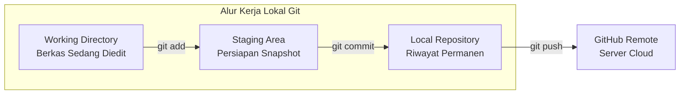

# Modul 2
## Penggunaan Git dan GitHub

Panduan praktis version control menggunakan Git dan GitHub untuk pemula sebelum melakukan deployment.

---
layout: default
---

# 1. Mengenal Version Control System (VCS)

**Version Control System (VCS)** adalah sistem yang mencatat setiap riwayat perubahan pada berkas kode dari waktu ke waktu.

### Mengapa Kita Membutuhkan Git?

Tanpa sistem kontrol versi, pemula sering kali menduplikasi folder secara manual:
- `website-final/`
- `website-final-beneran/`
- `website-final-fix-banget/`

Cara tersebut membingungkan dan memakan ruang penyimpanan. Git memecahkan masalah ini dengan mencatat riwayat perubahan (*commit*) secara rapi di dalam satu proyek.

  <b>Analogi Sederhana:</b> Git bekerja seperti kamera yang mengambil foto (<i>snapshot</i>) riwayat proyek Anda setiap kali ada perubahan. GitHub adalah album foto daring (<i>cloud storage</i>) tempat Anda menyimpan foto-foto tersebut agar aman dan dapat diakses dari mana saja.

---
layout: default
---

# 1. Perbedaan Git dan GitHub

| Aspek | Git | GitHub |
| :--- | :--- | :--- |
| **Kategori** | Perangkat lunak / aplikasi (*tool*) | Layanan berbasis web (*cloud hosting*) |
| **Instalasi** | Dipasang di komputer lokal Anda | Diakses melalui browser di `github.com` |
| **Fungsi Utama** | Mencatat riwayat perubahan kode | Menyimpan salinan repository Git secara online |
| **Akses Jaringan** | Bekerja secara *offline* di laptop/PC | Membutuhkan koneksi internet |
| **Kolaborasi** | Berfokus pada pengelolaan lokal | Memudahkan berbagi kode dan kerja tim |

  <b>Hubungan dengan Deployment:</b> Platform hosting modern seperti Netlify membaca langsung berkas kode dari repositori <b>GitHub</b> Anda untuk menjalankan otomatisasi rilis.

---
layout: default
---

# 2. Tiga Area Kerja dalam Git

Sebelum menjalankan perintah, pahami alur perpindahan berkas di dalam Git:

  <b>1. Working Directory:</b> Folder proyek tempat Anda mengedit kode HTML, CSS, dan JS.

  <b>2. Staging Area:</b> Ruang persiapan untuk memilih berkas yang siap disimpan (<code>git add</code>).

  <b>3. Local Repository:</b> Tempat penyimpanan riwayat permanen di folder <code>.git</code> lokal.

---
layout: default
---

# 3. Konfigurasi Awal & Inisialisasi Proyek

  
A. Menentukan Identitas Developer (Satu Kali Setup)

  <pre class="bg-slate-200 dark:bg-slate-900 p-2 rounded text-cyan-800 dark:text-cyan-300 font-mono">git config --global user.name "Nama Lengkap Anda"
git config --global user.email "email.anda@contoh.com"
git config --list</pre>

  
B. Menginisialisasi Proyek Baru (<code>git init</code>)

  Jalankan perintah ini di dalam folder proyek website Anda:
  <pre class="bg-slate-200 dark:bg-slate-900 p-2 rounded text-emerald-800 dark:text-emerald-300 font-mono mt-1">git init</pre>
  Perintah ini membuat folder tersembunyi <code>.git</code> agar proyek mulai dipantau.

---
layout: default
---

# 4. Alur Perintah Dasar: Add & Commit

  1. Memeriksa Status Berkas (<code>git status</code>)
  <pre class="bg-slate-200 dark:bg-slate-900 p-2 rounded text-cyan-800 dark:text-cyan-300 font-mono mt-1">git status</pre>
  Menampilkan berkas baru (untracked), berkas yang dimodifikasi, atau berkas di staging.

  2. Memasukkan Berkas ke Staging Area (<code>git add</code>)
  <pre class="bg-slate-200 dark:bg-slate-900 p-2 rounded text-cyan-800 dark:text-cyan-300 font-mono mt-1">git add .</pre>
  Tanda titik (<code>.</code>) berarti menambahkan seluruh berkas di folder saat ini ke staging area.

  3. Menyimpan Snapshot Riwayat (<code>git commit</code>)
  <pre class="bg-slate-200 dark:bg-slate-900 p-2 rounded text-cyan-800 dark:text-cyan-300 font-mono mt-1">git commit -m "feat: inisialisasi struktur web statis"</pre>
  Flag <code>-m</code> menyertakan pesan penjelasan perubahan secara ringkas dan jelas.

---
layout: default
---

# 5. Menghubungkan Proyek Lokal ke GitHub

<ol class="space-y-2 text-xs mt-2">
  <li class="p-2 rounded bg-slate-100 dark:bg-slate-800 border border-slate-200 dark:border-slate-700">
    1. Buat Repository di GitHub: Buka <a href="https://github.com" target="_blank" class="underline text-cyan-600">github.com</a> ➔ Klik <b>New</b> ➔ Beri nama repo (contoh: <code>kalkulator-diskon</code>) ➔ Public ➔ Klik <b>Create repository</b>.
  </li>
  <li class="p-2 rounded bg-slate-100 dark:bg-slate-800 border border-slate-200 dark:border-slate-700">
    2. Namai Branch Utama:
    <pre class="bg-slate-200 dark:bg-slate-900 p-1.5 rounded text-cyan-800 dark:text-cyan-300 font-mono mt-1">git branch -M main</pre>
  </li>
  <li class="p-2 rounded bg-slate-100 dark:bg-slate-800 border border-slate-200 dark:border-slate-700">
    3. Tambahkan Alamat Remote:
    <pre class="bg-slate-200 dark:bg-slate-900 p-1.5 rounded text-cyan-800 dark:text-cyan-300 font-mono mt-1">git remote add origin https://github.com/username-anda/kalkulator-diskon.git</pre>
  </li>
  <li class="p-2 rounded bg-slate-100 dark:bg-slate-800 border border-slate-200 dark:border-slate-700">
    4. Unggah Kode ke GitHub (Push):
    <pre class="bg-slate-200 dark:bg-slate-900 p-1.5 rounded text-emerald-800 dark:text-emerald-300 font-mono mt-1">git push -u origin main</pre>
  </li>
</ol>

---
layout: default
---

# Ringkasan Modul 2

  <carbon:checkmark-filled class="text-emerald-600 dark:text-emerald-400" />
  <b>Version Control:</b> Git mencatat riwayat perubahan kode sehingga mudah ditinjau dan dikembalikan jika ada error.

  <carbon:checkmark-filled class="text-emerald-600 dark:text-emerald-400" />
  <b>Git vs GitHub:</b> Git adalah alat lokal; GitHub adalah platform cloud hosting untuk repositori Git.

  <carbon:checkmark-filled class="text-emerald-600 dark:text-emerald-400" />
  <b>3 Area Kerja:</b> <i>Working Directory</i> ➔ <code>git add</code> (Staging) ➔ <code>git commit</code> (Local Repo).

  <carbon:checkmark-filled class="text-emerald-600 dark:text-emerald-400" />
  <b>Siklus Harian:</b> <code>git add .</code> ➔ <code>git commit -m "pesan"</code> ➔ <code>git push</code>.

  Selanjutnya di Modul 3 ➔ Praktik Deploy Website Statis ke Netlify!

