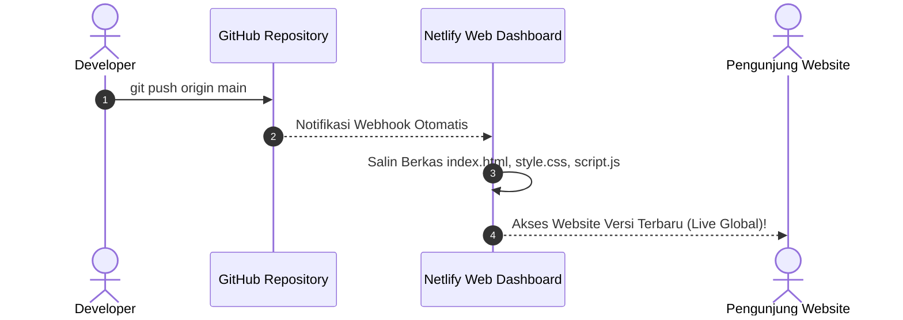

# Modul 3
## Deploy Website Statis ke Netlify

Panduan langkah demi langkah mempublikasikan website statis langsung dari repositori GitHub ke Netlify menggunakan antarmuka web dashboard tanpa command line dan tanpa netlify.toml.

---
layout: default
---

# 1. Mengenal Karakteristik Website Statis

**Website Statis** adalah web yang terdiri dari berkas HTML, CSS, JavaScript, dan media yang disajikan langsung ke browser pengguna tanpa memerlukan proses database server yang kompleks.

### Struktur Berkas Proyek (`sources/01-frontend-static/`)

<div class="grid grid-cols-2 gap-4 mt-4 text-xs">

```plaintext
sources/01-frontend-static/
  ├── index.html   # Antarmuka kalkulator
  ├── style.css    # Desain visual halaman
  ├── script.js    # Perhitungan di browser
  └── README.md    # Petunjuk proyek
```

<div class="p-3 rounded-lg bg-blue-50 dark:bg-blue-950/40 border border-blue-200 dark:border-blue-800/50 text-blue-950 dark:text-blue-100 leading-relaxed">
  <div class="font-bold text-blue-700 dark:text-blue-400 mb-2">Keunggulan Web Statis di Netlify:</div>
  • <b>Tanpa Konfigurasi Rumit:</b> Netlify otomatis mendeteksi berkas <code>index.html</code>.<br>
  • <b>Tanpa <code>netlify.toml</code>:</b> Cukup struktur folder standar.<br>
  • <b>Cepat & Ringan:</b> Langsung di-cache oleh CDN global.<br>
  • <b>Hemat Biaya:</b> Paket gratis Netlify sangat mencukupi.
</div>

</div>

---
layout: default
---

# 2. Mengapa Memilih Netlify Dashboard (Web UI)?

Bagi pemula, antarmuka web grafis (*dashboard*) Netlify memberikan kemudahan maksimal:

<div class="grid grid-cols-3 gap-4 mt-6 text-xs">

<div class="p-4 rounded-lg bg-slate-100 dark:bg-slate-800 border border-slate-200 dark:border-slate-700 text-center">
  <div class="font-bold text-cyan-700 dark:text-cyan-400 text-sm mb-2">1. Tanpa CLI Terminal</div>
  Tidak perlu menginstal peralatan Netlify CLI tambahan di komputer Anda.
</div>

<div class="p-4 rounded-lg bg-slate-100 dark:bg-slate-800 border border-slate-200 dark:border-slate-700 text-center">
  <div class="font-bold text-emerald-700 dark:text-emerald-400 text-sm mb-2">2. Visual & Transparan</div>
  Riwayat rilis, status deployment, dan pratinjau situs terpantau jelas di browser.
</div>

<div class="p-4 rounded-lg bg-slate-100 dark:bg-slate-800 border border-slate-200 dark:border-slate-700 text-center">
  <div class="font-bold text-purple-700 dark:text-purple-400 text-sm mb-2">3. Terhubung ke GitHub</div>
  Satu kali klik otorisasi, seluruh rilis berikutnya berjalan otomatis via <i>Continuous Deployment</i>.
</div>

</div>

---
layout: default
---

# 3. Langkah Deploy via Netlify Dashboard

<ol class="space-y-2 text-xs mt-2">
  <li class="p-2 rounded bg-slate-100 dark:bg-slate-800 border border-slate-200 dark:border-slate-700">
    <span class="font-bold text-cyan-700 dark:text-cyan-400">1. Buka Netlify & Login:</span> Masuk ke <a href="https://app.netlify.com" target="_blank" class="underline text-cyan-600">app.netlify.com</a> ➔ Klik <b>Sign in with GitHub</b>.
  </li>
  <li class="p-2 rounded bg-slate-100 dark:bg-slate-800 border border-slate-200 dark:border-slate-700">
    <span class="font-bold text-cyan-700 dark:text-cyan-400">2. Tambahkan Situs:</span> Klik tombol <b>Add new site</b> ➔ Pilih <b>Import an existing project</b>.
  </li>
  <li class="p-2 rounded bg-slate-100 dark:bg-slate-800 border border-slate-200 dark:border-slate-700">
    <span class="font-bold text-cyan-700 dark:text-cyan-400">3. Pilih Provider GitHub:</span> Klik <b>GitHub</b> ➔ Pilih repositori <code>kalkulator-diskon</code> yang telah dibuat di Modul 2.
  </li>
  <li class="p-2 rounded bg-slate-100 dark:bg-slate-800 border border-slate-200 dark:border-slate-700">
    <span class="font-bold text-cyan-700 dark:text-cyan-400">4. Konfigurasi Build Settings di Web:</span>
    Branch = <code>main</code>, Base directory = (kosongkan), Build command = (kosongkan), Publish directory = (kosongkan / <code>.</code>).
  </li>
  <li class="p-2 rounded bg-slate-100 dark:bg-slate-800 border border-slate-200 dark:border-slate-700">
    <span class="font-bold text-emerald-700 dark:text-emerald-400">5. Klik Deploy:</span> Klik <b>Deploy kalkulator-diskon</b>. Dalam beberapa detik, status berubah menjadi <b>Published</b> dan website sudah online!
  </li>
</ol>

---
layout: default
---

# 4. Alur Kerja Otomatisasi GitHub ke Netlify

Setelah terhubung, arsitektur otomatisasi bekerja secara transparan:



---
layout: default
---

# 5. Mengubah Nama Subdomain di Netlify

Nama domain acak (seperti `brave-curie-123456.netlify.app`) dapat diubah agar mudah dibaca:

<div class="space-y-3 mt-4 text-xs">

<div class="p-3 rounded bg-slate-100 dark:bg-slate-800 border border-slate-200 dark:border-slate-700">
  <span class="font-bold text-cyan-700 dark:text-cyan-400">1. Buka Menu Konfigurasi Situs:</span>
  Masuk ke halaman situs di Netlify Dashboard ➔ Klik menu <b>Site configuration</b> di bilah kiri.
</div>

<div class="p-3 rounded bg-slate-100 dark:bg-slate-800 border border-slate-200 dark:border-slate-700">
  <span class="font-bold text-cyan-700 dark:text-cyan-400">2. Pilih Site Details:</span>
  Pilih menu <b>General</b> ➔ <b>Site details</b>.
</div>

<div class="p-3 rounded bg-slate-100 dark:bg-slate-800 border border-slate-200 dark:border-slate-700">
  <span class="font-bold text-emerald-700 dark:text-emerald-400">3. Klik Change Site Name:</span>
  Masukkan nama yang diinginkan (contoh: <code>kalkulator-diskon-budi</code>) ➔ Klik <b>Save</b>.<br>
  Tautan resmi website Anda kini menjadi: <code>https://kalkulator-diskon-budi.netlify.app</code>.
</div>

</div>

---
layout: default
---

# 6. Membuktikan Otomatisasi CI/CD

Uji alur otomatisasi pembaruan kode secara langsung:

<ol class="space-y-3 mt-4 text-xs">
  <li class="p-3 rounded bg-slate-100 dark:bg-slate-800 border border-slate-200 dark:border-slate-700">
    <span class="font-bold text-cyan-700 dark:text-cyan-400">1. Ubah Kode di VS Code:</span>
    Edit teks judul di <code>index.html</code> atau warna tombol di <code>style.css</code>.
  </li>
  <li class="p-3 rounded bg-slate-100 dark:bg-slate-800 border border-slate-200 dark:border-slate-700">
    <span class="font-bold text-cyan-700 dark:text-cyan-400">2. Jalankan Perintah Git di Terminal:</span>
    <pre class="bg-slate-200 dark:bg-slate-900 p-1.5 rounded text-cyan-800 dark:text-cyan-300 font-mono mt-1">git add . && git commit -m "style: ubah warna tombol" && git push</pre>
  </li>
  <li class="p-3 rounded bg-slate-100 dark:bg-slate-800 border border-slate-200 dark:border-slate-700">
    <span class="font-bold text-emerald-700 dark:text-emerald-400">3. Pantau Tab Deploys di Browser Netlify:</span>
    Netlify otomatis mendeteksi commit baru dan memperbarui website live dalam hitungan detik tanpa perlu menekan tombol apa pun di Netlify!
  </li>
</ol>

---
layout: default
---

# 7. Pengujian & Penyelesaian Masalah

<div class="space-y-3 mt-3 text-xs">

<div class="p-3 rounded-lg bg-slate-100 dark:bg-slate-800 border border-slate-200 dark:border-slate-700">
  <div class="font-bold text-emerald-700 dark:text-emerald-400 mb-1">Verifikasi Hasil Rilis:</div>
  • Pastikan ikon gembok <b>HTTPS</b> aktif di browser.<br>
  • Uji fungsionalitas kalkulator diskon (input harga & persentase).<br>
  • Buka <b>Console (F12)</b> untuk memastikan bebas dari error JavaScript.
</div>

<div class="p-3 rounded-lg bg-amber-50 dark:bg-amber-950/40 border-l-4 border-amber-500 text-amber-950 dark:text-amber-100">
  <div class="font-bold text-amber-700 dark:text-amber-400 mb-1">Kendala Umum & Solusi:</div>
  • <b>404 Page Not Found:</b> Pastikan berkas utama bernama persis <code>index.html</code> (huruf kecil) di akar repositori.<br>
  • <b>CSS Tidak Muncul:</b> Ganti absolute path lokal (<code>C:/...</code>) dengan relative path (<code>href="style.css"</code>).<br>
  • <b>Case-Sensitivity:</b> Server Linux Netlify membedakan huruf besar/kecil (gunakan huruf kecil semua).
</div>

</div>

---
layout: default
---

# Ringkasan Modul 3

<div class="p-4 rounded-lg bg-slate-100 dark:bg-slate-800 border border-slate-200 dark:border-slate-700 space-y-3 mt-4 text-xs">

<div class="flex items-center space-x-2">
  <carbon:checkmark-filled class="text-emerald-600 dark:text-emerald-400" />
  <span><b>Netlify Dashboard (Web UI):</b> Deploy visual yang ramah pemula tanpa instalasi CLI dan tanpa <code>netlify.toml</code>.</span>
</div>

<div class="flex items-center space-x-2">
  <carbon:checkmark-filled class="text-emerald-600 dark:text-emerald-400" />
  <span><b>Integrasi GitHub:</b> Menghubungkan repositori untuk memicu proses build dan deploy otomatis di cloud.</span>
</div>

<div class="flex items-center space-x-2">
  <carbon:checkmark-filled class="text-emerald-600 dark:text-emerald-400" />
  <span><b>Otomatisasi CI/CD:</b> Cukup <code>git push</code>, website langsung terperbarui otomatis secara instan.</span>
</div>

<div class="flex items-center space-x-2">
  <carbon:checkmark-filled class="text-emerald-600 dark:text-emerald-400" />
  <span><b>Pengaturan Subdomain:</b> Menyesuaikan nama alamat website agar rapi dan mudah dibagikan.</span>
</div>

</div>

<div class="mt-8 text-center text-sm text-cyan-700 dark:text-cyan-400 font-bold">
  Selanjutnya di Modul 4 ➔ Benchmark Performa Website dengan Google Lighthouse!
</div>
