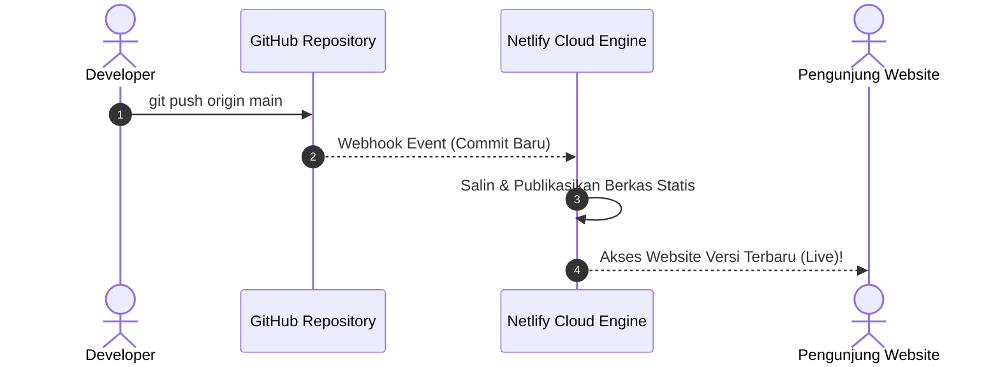

# Modul 3
## Deploy Website Statis ke Netlify

Panduan langkah demi langkah mempublikasikan website statis Vanilla HTML, CSS, dan JavaScript ke Netlify menggunakan Netlify CLI dan integrasi GitHub.

---
layout: default
---

# 1. Mengenal Karakteristik Website Statis

**Website Statis** adalah web yang terdiri dari berkas HTML, CSS, JavaScript, dan media yang disajikan langsung ke browser pengguna tanpa memerlukan proses database server yang kompleks.

### Struktur Berkas Proyek (`sources/01-frontend-static/`)

<div class="grid grid-cols-2 gap-4 mt-4 text-xs">

```plaintext
sources/01-frontend-static/
  ├── index.html   # Antarmuka kalkulator
  ├── style.css    # Desain visual halaman
  ├── script.js    # Perhitungan di browser
  ├── netlify.toml # Konfigurasi rilis
  └── README.md    # Petunjuk proyek
```

<div class="p-3 rounded-lg bg-blue-50 dark:bg-blue-950/40 border border-blue-200 dark:border-blue-800/50 text-blue-950 dark:text-blue-100 leading-relaxed">
  <div class="font-bold text-blue-700 dark:text-blue-400 mb-2">Keunggulan Web Statis:</div>
  • <b>Cepat & Ringan:</b> Di-cache oleh CDN global Netlify.<br>
  • <b>Hemat Biaya:</b> Paket gratis Netlify sangat mencukupi.<br>
  • <b>Aman:</b> Tidak ada celah server database langsung.<br>
  • <b>Mudah Di-maintain:</b> Cocok untuk pemula.
</div>

</div>

---
layout: default
---

# 2. Berkas Konfigurasi: `netlify.toml`

`netlify.toml` adalah berkas konfigurasi yang dibaca oleh Netlify saat memproses deployment website Anda:

```toml [netlify.toml]
# netlify.toml - Konfigurasi Website Statis
[build]
  publish = "."   # Direktori publikasi (titik berarti akar folder proyek)

[[headers]]
  for = "/*"
  [headers.values]
    X-Frame-Options = "DENY"
    X-Content-Type-Options = "nosniff"
```

<div class="mt-4 p-3 rounded-lg bg-slate-100 dark:bg-slate-800 border border-slate-200 dark:border-slate-700 text-xs">
  • <code>publish = "."</code>: Memberitahu Netlify bahwa berkas utama <code>index.html</code> berada di akar folder.<br>
  • <code>[[headers]]</code>: Menambahkan header keamanan dasar seperti proteksi dari serangan <i>Clickjacking</i>.
</div>

---
layout: default
---

# 3. Cara 1: Deployment Menggunakan Netlify CLI

Netlify CLI memungkinkan pengujian lokal dan rilis website langsung dari terminal:

<div class="space-y-2 mt-2 text-xs">

<div class="flex items-start space-x-3">
  <div class="bg-cyan-100 dark:bg-cyan-950 text-cyan-800 dark:text-cyan-300 font-bold px-2 py-1 rounded">Langkah 1</div>
  <div>
    <b>Masuk ke folder proyek:</b>
    <code class="block mt-1 bg-slate-100 dark:bg-slate-900 px-2 py-1 rounded text-cyan-700 dark:text-cyan-300 font-mono">cd sources/01-frontend-static</code>
  </div>
</div>

<div class="flex items-start space-x-3">
  <div class="bg-cyan-100 dark:bg-cyan-950 text-cyan-800 dark:text-cyan-300 font-bold px-2 py-1 rounded">Langkah 2</div>
  <div>
    <b>Login ke Akun Netlify:</b>
    <code class="block mt-1 bg-slate-100 dark:bg-slate-900 px-2 py-1 rounded text-cyan-700 dark:text-cyan-300 font-mono">npx netlify-cli login</code>
  </div>
</div>

<div class="flex items-start space-x-3">
  <div class="bg-cyan-100 dark:bg-cyan-950 text-cyan-800 dark:text-cyan-300 font-bold px-2 py-1 rounded">Langkah 3</div>
  <div>
    <b>Uji di Komputer Lokal (<code>http://localhost:8888</code>):</b>
    <code class="block mt-1 bg-slate-100 dark:bg-slate-900 px-2 py-1 rounded text-cyan-700 dark:text-cyan-300 font-mono">npx netlify-cli dev</code>
  </div>
</div>

<div class="flex items-start space-x-3">
  <div class="bg-cyan-100 dark:bg-cyan-950 text-cyan-800 dark:text-cyan-300 font-bold px-2 py-1 rounded">Langkah 4</div>
  <div>
    <b>Deploy ke Draft / Preview Environment:</b>
    <code class="block mt-1 bg-slate-100 dark:bg-slate-900 px-2 py-1 rounded text-cyan-700 dark:text-cyan-300 font-mono">npx netlify-cli deploy</code>
    <span class="opacity-75">Pilih 'Create & configure a new site', isi <code>.</code> untuk publish directory.</span>
  </div>
</div>

<div class="flex items-start space-x-3">
  <div class="bg-emerald-100 dark:bg-emerald-950 text-emerald-800 dark:text-emerald-300 font-bold px-2 py-1 rounded">Langkah 5</div>
  <div>
    <b>Deploy ke Production (Live URL Resmi):</b>
    <code class="block mt-1 bg-slate-100 dark:bg-slate-900 px-2 py-1 rounded text-emerald-700 dark:text-emerald-300 font-mono">npx netlify-cli deploy --prod</code>
  </div>
</div>

</div>

---
layout: default
---

# 4. Cara 2: Deployment Otomatis via GitHub (CI/CD)

Alur kerja standar industri yang otomatis memperbarui website setiap kali ada push ke GitHub:



---
layout: default
---

# 4. Langkah Integrasi GitHub di Netlify Dashboard

<ol class="space-y-2 text-xs mt-2">
  <li class="p-2 rounded bg-slate-100 dark:bg-slate-800 border border-slate-200 dark:border-slate-700">
    <span class="font-bold text-cyan-700 dark:text-cyan-400">1. Pastikan Kode Sudah di GitHub:</span>
    <pre class="bg-slate-200 dark:bg-slate-900 p-1.5 rounded text-cyan-800 dark:text-cyan-300 font-mono mt-1">git add . && git commit -m "feat: website kalkulator"
git push -u origin main</pre>
  </li>
  <li class="p-2 rounded bg-slate-100 dark:bg-slate-800 border border-slate-200 dark:border-slate-700">
    <span class="font-bold text-cyan-700 dark:text-cyan-400">2. Buka Netlify Dashboard:</span> Masuk ke <a href="https://app.netlify.com" target="_blank" class="underline text-cyan-600">app.netlify.com</a> ➔ Klik <b>Add new site</b> ➔ <b>Import from an existing project</b>.
  </li>
  <li class="p-2 rounded bg-slate-100 dark:bg-slate-800 border border-slate-200 dark:border-slate-700">
    <span class="font-bold text-cyan-700 dark:text-cyan-400">3. Hubungkan GitHub & Pilih Repository:</span> Berikan izin ke repository <code>kalkulator-diskon</code>.
  </li>
  <li class="p-2 rounded bg-slate-100 dark:bg-slate-800 border border-slate-200 dark:border-slate-700">
    <span class="font-bold text-cyan-700 dark:text-cyan-400">4. Atur Build Settings:</span> Branch = <code>main</code>, Build command = (kosongkan), Publish directory = <code>.</code>.
  </li>
  <li class="p-2 rounded bg-slate-100 dark:bg-slate-800 border border-slate-200 dark:border-slate-700">
    <span class="font-bold text-emerald-700 dark:text-emerald-400">5. Klik Deploy Site:</span> Dalam hitungan detik website Anda sudah aktif dan live secara global.
  </li>
</ol>

---
layout: default
---

# 5. Pengujian & Verifikasi Hasil Deployment

Buka URL produksi yang diberikan Netlify di browser Anda:

<div class="grid grid-cols-3 gap-4 mt-6">

<div class="p-4 rounded-lg bg-slate-100 dark:bg-slate-800 border border-slate-200 dark:border-slate-700 text-center">
  <div class="font-bold text-emerald-700 dark:text-emerald-400 text-sm mb-1">1. Enkripsi HTTPS</div>
  <div class="text-xs opacity-80 mt-1">Pastikan ikon gembok aman (HTTPS) aktif di address bar browser.</div>
</div>

<div class="p-4 rounded-lg bg-slate-100 dark:bg-slate-800 border border-slate-200 dark:border-slate-700 text-center">
  <div class="font-bold text-cyan-700 dark:text-cyan-400 text-sm mb-1">2. Form Kalkulator</div>
  <div class="text-xs opacity-80 mt-1">Input harga: <code>100000</code> dan diskon: <code>20</code>. Klik Hitung Diskon.</div>
</div>

<div class="p-4 rounded-lg bg-slate-100 dark:bg-slate-800 border border-slate-200 dark:border-slate-700 text-center">
  <div class="font-bold text-purple-700 dark:text-purple-400 text-sm mb-1">3. Console Bebas Error</div>
  <div class="text-xs opacity-80 mt-1">Buka Developer Tools (F12) ➔ Tab Console bersih tanpa pesan merah.</div>
</div>

</div>

---
layout: default
---

# 6. Penyelesaian Masalah Umum (Troubleshooting)

<div class="space-y-4 mt-4">

<div class="p-3 rounded-lg bg-amber-50 dark:bg-amber-950/40 border-l-4 border-amber-500 text-amber-950 dark:text-amber-100">
  <div class="font-bold text-amber-700 dark:text-amber-400 text-xs">Kendala: Halaman 404 Page Not Found saat membuka URL</div>
  <div class="text-xs mt-1 leading-relaxed">
    • <b>Penyebab:</b> Berkas utama tidak bernama <code>index.html</code> atau lokasi publish directory salah.<br>
    • <b>Solusi:</b> Pastikan berkas bernama <code>index.html</code> (huruf kecil) dan berada tepat pada direktori publish.
  </div>
</div>

<div class="p-3 rounded-lg bg-amber-50 dark:bg-amber-950/40 border-l-4 border-amber-500 text-amber-950 dark:text-amber-100">
  <div class="font-bold text-amber-700 dark:text-amber-400 text-xs">Kendala: CSS atau JS tidak termuat (tampilan berantakan)</div>
  <div class="text-xs mt-1 leading-relaxed">
    • <b>Penyebab:</b> Tag HTML menggunakan absolute path lokal komputer (seperti <code>C:/Users/style.css</code>).<br>
    • <b>Solusi:</b> Gunakan relative path di HTML: <code>&lt;link rel="stylesheet" href="style.css"&gt;</code>.
  </div>
</div>

<div class="p-3 rounded-lg bg-amber-50 dark:bg-amber-950/40 border-l-4 border-amber-500 text-amber-950 dark:text-amber-100">
  <div class="font-bold text-amber-700 dark:text-amber-400 text-xs">Kendala: Berfungsi di Windows lokal tapi 404 di Netlify</div>
  <div class="text-xs mt-1 leading-relaxed">
    • <b>Penyebab:</b> Server Linux Netlify bersifat <i>case-sensitive</i> (membedakan <code>Index.html</code> dan <code>index.html</code>).<br>
    • <b>Solusi:</b> Selalu gunakan huruf kecil untuk penamaan seluruh berkas website.
  </div>
</div>

</div>

---
layout: default
---

# Ringkasan Modul 3

<div class="p-4 rounded-lg bg-slate-100 dark:bg-slate-800 border border-slate-200 dark:border-slate-700 space-y-3 mt-4 text-xs">

<div class="flex items-center space-x-2">
  <carbon:checkmark-filled class="text-emerald-600 dark:text-emerald-400" />
  <span><b>Netlify CLI:</b> Menggunakan <code>npx netlify-cli deploy --prod</code> untuk rilis cepat via terminal.</span>
</div>

<div class="flex items-center space-x-2">
  <carbon:checkmark-filled class="text-emerald-600 dark:text-emerald-400" />
  <span><b>Integrasi GitHub:</b> Otomatisasi rilis (*Continuous Deployment*) setiap kali terjadi push ke branch <code>main</code>.</span>
</div>

<div class="flex items-center space-x-2">
  <carbon:checkmark-filled class="text-emerald-600 dark:text-emerald-400" />
  <span><b>Konfigurasi <code>netlify.toml</code>:</b> Menentukan <code>publish = "."</code> dan header keamanan HTTP dasar.</span>
</div>

</div>

<div class="mt-8 text-center text-sm text-cyan-700 dark:text-cyan-400 font-bold">
  Selanjutnya di Modul 4 ➔ Benchmark Performa Website dengan Google Lighthouse!
</div>
