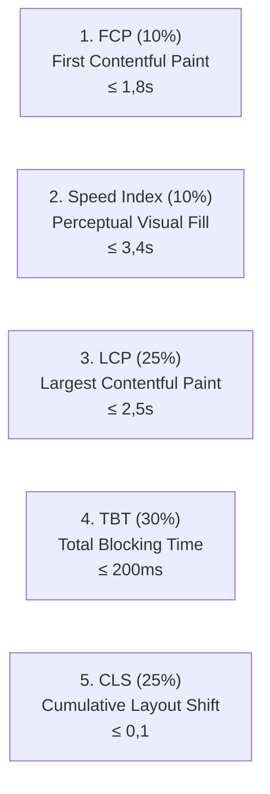

# Modul 4
## Benchmark Performa dengan Google Lighthouse

Panduan melakukan audit dan benchmark performa website statis menggunakan Google Lighthouse serta pemahaman mendalam mengenai 4 kategori skor audit dan 5 indikator metrik performa (FCP, LCP, CLS, TBT, Speed Index).

---
layout: default
---

# 1. Mengapa Performa Website Sangat Penting?

Ketika seseorang membuka website di ponsel atau komputer, setiap detik waktu pemuatan (*loading time*) sangat menentukan:

  
1. Kepuasan Pengguna

  Pengguna cenderung meninggalkan halaman (<i>bounce</i>) jika website membutuhkan waktu lebih dari 3 detik untuk terbuka.

  
2. Jaringan Terbatas

  Website yang ringan dan teroptimasi tetap dapat diakses lancar pada koneksi internet seluler yang kurang stabil.

  
3. Peringkat Google SEO

  Mesin pencari Google memprioritaskan website yang cepat, stabil, dan ramah pengguna perangkat ponsel (*Mobile-First*).

  <b>Benchmark Performa:</b> Proses pengujian dan pengukuran efisiensi kualitas website menggunakan kumpulan indikator metrik standar yang terukur.

---
layout: default
---

# 2. Mengenal Google Lighthouse & 4 Kategori Audit

**Google Lighthouse** adalah alat audit otomatis open-source dari Google yang tertanam langsung di dalam browser Google Chrome Developer Tools.

  
1. Performance

  Mengukur kecepatan memuat aset, responsivitas klik, dan kestabilan tampilan visual halaman.

  
2. Accessibility

  Mengukur kemudahan akses halaman bagi seluruh pengguna, termasuk penyandang disabilitas (*screen reader*).

  
3. Best Practices

  Menguji kepatuhan terhadap standar keamanan web modern (protokol HTTPS, sintaks kode aman).

  
4. SEO

  Menguji kelengkapan metadata agar halaman mudah ditemukan dan diindeks oleh mesin pencari Google.

---
layout: default
---

# 3. Kategori 1: 5 Indikator Metrik Performa Lighthouse

Mengukur kecepatan pemuatan halaman, efisiensi eksekusi script, dan kestabilan tata letak visual:

  

    • <b>FCP (10%):</b> Konten visual pertama muncul di layar (&le; 1,8s). 
    • <b>Speed Index (10%):</b> Kecepatan visual halaman terisi (&le; 3,4s). 
    • <b>LCP (25%):</b> Elemen konten visual terbesar selesai dimuat (&le; 2,5s).
  

  

    • <b>TBT (30%):</b> Beban pemblokiran JavaScript pada main thread (&le; 200ms). 
    • <b>CLS (25%):</b> Kestabilan layout tanpa pergeseran mendadak (&le; 0,1). 
    TBT + LCP + CLS menyumbang 80% total skor Performance!
  

---
layout: default
---

# 4. Kategori 2: Accessibility (Aksesibilitas)

Memastikan website ramah bagi seluruh pengguna, termasuk penyandang disabilitas:

  
1. Kontras Warna Teks (Color Contrast)

  Rasio perbedaan warna teks terhadap warna latar belakang minimal <b>4.5:1</b> agar mudah dibaca oleh pengguna dengan keterbatasan penglihatan.

  
2. Atribut Teks Alternatif Gambar (<code>alt="..."</code>)

  Setiap tag <code>&lt;img&gt;</code> wajib menyertakan deskripsi alternatif agar dapat dibacakan oleh aplikasi <i>screen reader</i> tunanetra.

  
3. Label Input Form & Hierarki Heading

  Setiap <code>&lt;input&gt;</code> wajib terhubung dengan <code>&lt;label for="..."&gt;</code>, serta urutan heading bertingkat teratur (<code>&lt;h1&gt;</code> ke <code>&lt;h2&gt;</code>).

---
layout: default
---

# 5. Kategori 3: Best Practices & Kategori 4: SEO

  
Best Practices (Standar Keamanan)

  <ul class="space-y-1.5 opacity-90 leading-relaxed">
    <li>• <b>HTTPS Penuh:</b> Bebas dari <i>Mixed Content</i> (tanpa HTTP biasa).</li>
    <li>• <b>Bebas Error di Console:</b> Tab Console bersih tanpa pesan merah.</li>
    <li>• <b>Library Aman:</b> Tidak memakai pustaka usang dengan celah keamanan.</li>
    <li>• <b>Aspek Rasio Gambar:</b> Gambar ditampilkan proporsional tanpa distorsi.</li>
  </ul>

  
SEO (Optimasi Mesin Pencari)

  <ul class="space-y-1.5 opacity-90 leading-relaxed">
    <li>• <b>Tag Judul (<code>&lt;title&gt;</code>):</b> Memiliki judul halaman deskriptif.</li>
    <li>• <b>Meta Description:</b> Ringkasan halaman untuk cuplikan pencarian.</li>
    <li>• <b>Mobile Viewport:</b> Tag meta responsif layar smartphone.</li>
    <li>• <b>Descriptive Link:</b> Teks link bermakna jelas (bukan "klik di sini").</li>
  </ul>

---
layout: default
---

# 6. Membaca & Menginterpretasikan Skor Audit

Lighthouse menyajikan skor setiap kategori dalam rentang angka 0 hingga 100:

  
90 – 100

  
Sangat Baik (Hijau)

  Website memenuhi standar performa dan kualitas optimal industri.

  
50 – 89

  
Cukup Baik (Oranye)

  Berfungsi normal, namun masih ada aspek yang dapat dioptimalkan.

  
0 – 49

  
Perlu Perbaikan (Merah)

  Terdapat kendala signifikan yang mempengaruhi kenyamanan pengguna.

  • <b>Opportunities:</b> Rekomendasi tindakan spesifik untuk memangkas waktu pemuatan berkas. 
  • <b>Diagnostics:</b> Laporan teknis mendalam mengenai ukuran berkas dan efisiensi script.

---
layout: default
---

# 7. Langkah Menjalankan Audit Lighthouse

<ol class="space-y-2 text-xs mt-2">
  <li class="p-2 rounded bg-slate-100 dark:bg-slate-800 border border-slate-200 dark:border-slate-700">
    1. Buka Chrome Incognito Window:
    Tekan <kbd>Ctrl + Shift + N</kbd> (Windows) atau <kbd>Cmd + Shift + N</kbd> (Mac) agar bebas dari ekstensi browser.
  </li>
  <li class="p-2 rounded bg-slate-100 dark:bg-slate-800 border border-slate-200 dark:border-slate-700">
    2. Buka URL Netlify Website Anda:
    Ketikkan alamat live situs (contoh: <code>https://kalkulator-diskon-budi.netlify.app</code>).
  </li>
  <li class="p-2 rounded bg-slate-100 dark:bg-slate-800 border border-slate-200 dark:border-slate-700">
    3. Buka Developer Tools (F12):
    Tekan <kbd>F12</kbd> ➔ Pilih tab <b>Lighthouse</b> pada bilah atas panel.
  </li>
  <li class="p-2 rounded bg-slate-100 dark:bg-slate-800 border border-slate-200 dark:border-slate-700">
    4. Atur Konfigurasi Audit:
    Pilih Device: <b>Mobile</b> atau <b>Desktop</b>, dan centang keempat kategori audit.
  </li>
  <li class="p-2 rounded bg-slate-100 dark:bg-slate-800 border border-slate-200 dark:border-slate-700">
    5. Jalankan Proses Audit:
    Klik tombol <b>Analyze page load</b> dan tunggu sekitar 15–30 detik hingga laporan skor lengkap muncul.
  </li>
</ol>

---
layout: default
---

# 8. Tips Optimasi Performa Website Statis

  
1. Optimasi Berkas Gambar

  Gunakan format modern seperti <b>WebP</b> atau <b>SVG</b>. Cantumkan atribut <code>width</code> dan <code>height</code> pada tag <code>&lt;img&gt;</code> untuk mencegah pergeseran layout (CLS).

  
2. Minifikasi CSS dan JavaScript

  Bersihkan spasi kosong dan komentar yang tidak diperlukan pada berkas <code>style.css</code> dan <code>script.js</code> agar ukuran unduhan berkas semakin kecil.

  
3. Memanfaatkan Global CDN Netlify

  Netlify secara otomatis menerapkan kompresi <b>Brotli / Gzip</b> dan menyajikan berkas dari edge server terdekat dengan lokasi pengunjung.

---
layout: default
---

# Ringkasan Modul 4

  <carbon:checkmark-filled class="text-emerald-600 dark:text-emerald-400" />
  <b>4 Kategori Audit:</b> Performance (kecepatan), Accessibility (ramah disabilitas), Best Practices (keamanan), dan SEO (mesin pencari).

  <carbon:checkmark-filled class="text-emerald-600 dark:text-emerald-400" />
  <b>5 Metrik Performa:</b> FCP (10%), Speed Index (10%), LCP (25%), TBT (30%), dan CLS (25%).

  <carbon:checkmark-filled class="text-emerald-600 dark:text-emerald-400" />
  <b>Interpretasi Skor:</b> Hijau (90–100 Baik), Oranye (50–89 Cukup), Merah (0–49 Buruk).

  <carbon:checkmark-filled class="text-emerald-600 dark:text-emerald-400" />
  <b>Pengujian Akurat:</b> Jalankan selalu pada Jendela Penyamaran (Incognito Window) Google Chrome.

  Selanjutnya di Bagian Referensi ➔ Cheatsheet Perintah & Panduan Troubleshooting!

