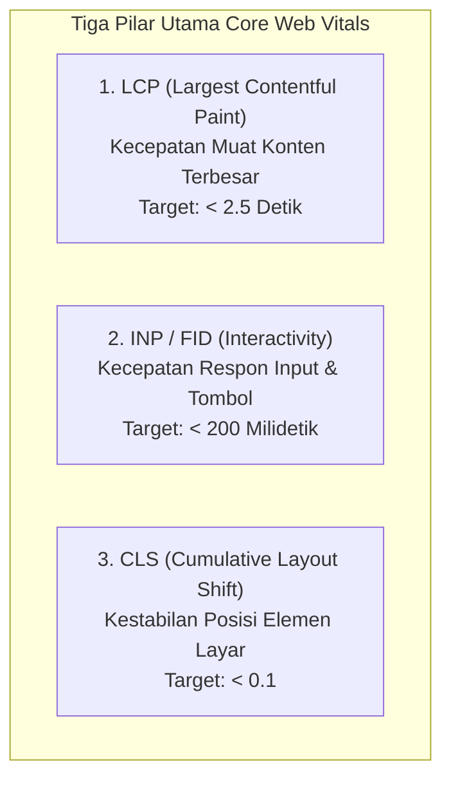

# Modul 4
## Benchmark Performa dengan Google Lighthouse

Panduan melakukan audit dan benchmark performa website statis menggunakan Google Lighthouse serta memahami indikator Core Web Vitals.

---
layout: default
---

# 1. Mengapa Performa Website Sangat Penting?

Ketika seseorang membuka website di ponsel atau komputer, setiap detik waktu pemuatan (*loading time*) sangat menentukan:

  
1. Kepuasan Pengguna

  Pengguna cenderung meninggalkan halaman (<i>bounce</i>) jika website membutuhkan waktu lebih dari 3 detik untuk terbuka.

  
2. Jaringan Terbatas

  Website yang ringan dan teroptimasi tetap dapat diakses lancar pada koneksi internet seluler yang kurang stabil.

  
3. Peringkat Google SEO

  Mesin pencari Google memprioritaskan website yang cepat, stabil, dan ramah pengguna perangkat ponsel (*Mobile-First*).

  <b>Benchmark Performa:</b> Proses pengujian dan pengukuran efisiensi kecepatan website menggunakan indikator metrik standar yang terukur.

---
layout: default
---

# 2. Mengenal Google Lighthouse & 4 Kategori Audit

**Google Lighthouse** adalah alat audit otomatis open-source dari Google yang tertanam langsung di dalam browser Google Chrome.

| Kategori Audit | Aspek yang Dinilai | Target Ideal |
| :--- | :--- | :--- |
| **Performance** | Kecepatan pemuatan berkas, respon klik tombol, dan kestabilan antarmuka. | Skor 90 – 100 |
| **Accessibility** | Ramah bagi seluruh kalangan pengguna (kontras warna teks, teks alt gambar). | Skor 90 – 100 |
| **Best Practices** | Kepatuhan standar keamanan web modern (protokol HTTPS, sintaks aman). | Skor 90 – 100 |
| **SEO** | Kelengkapan informasi dasar halaman agar mudah diindeks mesin pencari. | Skor 90 – 100 |

---
layout: default
---

# 3. Memahami Metrik Kunci: Core Web Vitals

Tiga metrik utama yang digunakan untuk menilai kualitas kecepatan halaman web:

  

    <b>LCP:</b> Waktu hingga gambar/teks utama selesai ditampilkan di layar.
  

  

    <b>INP:</b> Durasi jeda saat tombol ditekan hingga browser memproses logika.
  

  

    <b>CLS:</b> Menghindari elemen melompat/bergeser tiba-tiba saat loading.
  

---
layout: default
---

# 4. Langkah Menjalankan Audit Lighthouse

<ol class="space-y-2 text-xs mt-2">
  <li class="p-2 rounded bg-slate-100 dark:bg-slate-800 border border-slate-200 dark:border-slate-700">
    1. Buka Chrome Incognito Window:
    Tekan <kbd>Ctrl + Shift + N</kbd> (Windows) atau <kbd>Cmd + Shift + N</kbd> (Mac) agar pengujian bebas dari pengaruh ekstensi browser.
  </li>
  <li class="p-2 rounded bg-slate-100 dark:bg-slate-800 border border-slate-200 dark:border-slate-700">
    2. Masukkan URL Website Netlify:
    Buka URL live website statis Anda (contoh: <code>https://nama-aplikasi.netlify.app</code>).
  </li>
  <li class="p-2 rounded bg-slate-100 dark:bg-slate-800 border border-slate-200 dark:border-slate-700">
    3. Buka Developer Tools (F12):
    Tekan <kbd>F12</kbd> ➔ Pilih tab <b>Lighthouse</b> pada panel atas.
  </li>
  <li class="p-2 rounded bg-slate-100 dark:bg-slate-800 border border-slate-200 dark:border-slate-700">
    4. Atur Konfigurasi Audit:
    Pilih Device: <b>Mobile</b> atau <b>Desktop</b>, dan centang seluruh kategori yang ingin dinilai.
  </li>
  <li class="p-2 rounded bg-slate-100 dark:bg-slate-800 border border-slate-200 dark:border-slate-700">
    5. Jalankan Audit:
    Klik tombol <b>Analyze page load</b> dan tunggu sekitar 15–30 detik hingga laporan skor muncul.
  </li>
</ol>

---
layout: default
---

# 5. Membaca & Menginterpretasikan Skor

Lighthouse memberikan skor angka 0 hingga 100 dengan indikator warna:

  
90 – 100

  
Sangat Baik (Hijau)

  Website telah memenuhi standar performa dan kualitas optimal.

  
50 – 89

  
Cukup Baik (Oranye)

  Berfungsi normal, namun masih ada potensi penghematan waktu muat.

  
0 – 49

  
Perlu Perbaikan (Merah)

  Pemuatan terlalu lambat atau ada kendala performa mendesak.

  • <b>Opportunities:</b> Rekomendasi tindakan spesifik untuk memangkas waktu muat. 
  • <b>Diagnostics:</b> Analisis detail struktur aset dan efisiensi eksekusi script.

---
layout: default
---

# 6. Tips Optimasi Performa Website Statis

  
1. Optimasi Berkas Gambar

  Gunakan format modern seperti <b>WebP</b> atau <b>SVG</b>. Cantumkan atribut <code>width</code> dan <code>height</code> pada tag <code>&lt;img&gt;</code> untuk mencegah lonjakan pergeseran layout (CLS).

  
2. Minifikasi CSS dan JavaScript

  Bersihkan spasi kosong dan baris komentar yang tidak diperlukan pada berkas <code>style.css</code> dan <code>script.js</code> agar ukuran berkas yang diunduh browser lebih kecil.

  
3. Memanfaatkan Global CDN Netlify

  Netlify secara otomatis menerapkan kompresi <b>Brotli / Gzip</b> dan menyajikan berkas dari edge server terdekat dengan lokasi pengunjung.

---
layout: default
---

# Ringkasan Modul 4

  <carbon:checkmark-filled class="text-emerald-600 dark:text-emerald-400" />
  <b>Tujuan Benchmark:</b> Memastikan website yang dirilis memiliki performa terukur, stabil, dan cepat.

  <carbon:checkmark-filled class="text-emerald-600 dark:text-emerald-400" />
  <b>4 Kategori Lighthouse:</b> Performance, Accessibility, Best Practices, dan SEO.

  <carbon:checkmark-filled class="text-emerald-600 dark:text-emerald-400" />
  <b>Core Web Vitals:</b> LCP (&lt; 2,5 detik), INP (&lt; 200 ms), dan CLS (&lt; 0,1).

  <carbon:checkmark-filled class="text-emerald-600 dark:text-emerald-400" />
  <b>Praktik Terbaik:</b> Jalankan audit di Incognito Window untuk hasil skor yang murni dan akurat.

  Selanjutnya di Bagian Referensi ➔ Cheatsheet Perintah & Panduan Troubleshooting!

