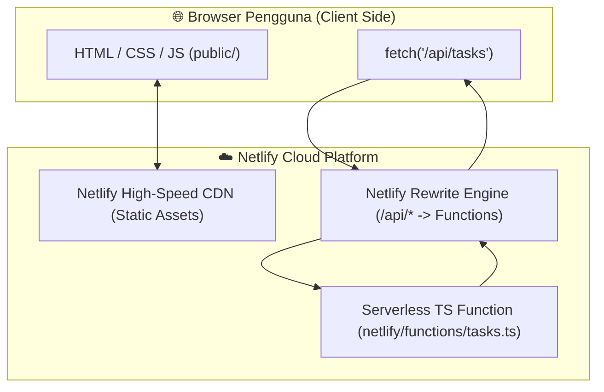

# Modul 4
## Deploy Fullstack App (Web & Backend)

Panduan menghubungkan Frontend Statis dengan Backend Serverless TypeScript, menangani CORS, dan me-deploy aplikasi fullstack secara utuh di Netlify.

---
layout: default
---

# 1. Arsitektur Aplikasi Fullstack di Netlify

Dalam arsitektur modern Jamstack / Serverless di Netlify, frontend dan backend berada dalam satu proyek (*monorepo*) namun dijalankan dengan peran masing-masing:



---
layout: default
---

# 2. Struktur Source Code (`sources/03-fullstack`)

```text
sources/03-fullstack/
├── public/                # Direktori Frontend Statis yang dipublikasikan
│   ├── index.html         # Tampilan antarmuka Task Manager
│   ├── style.css          # Styling tema gelap (Dark Theme)
│   └── app.js             # Logika Fetch API ke backend
├── netlify/
│   └── functions/
│       └── tasks.ts       # Backend Serverless TS (GET, POST, DELETE /api/tasks)
├── netlify.toml           # Konfigurasi unified build & rewrite rules
├── package.json           # Ketergantungan backend
├── tsconfig.json          # Konfigurasi TypeScript
└── README.md
```

---
layout: default
---

# 3. Komunikasi Client-Server & CORS

### Mengapa CORS Terjadi?
Jika frontend di `https://myfrontend.com` memanggil backend di `https://myapi.com`, browser memblokir permintaan demi alasan keamanan.

### Solusi Netlify: URL Rewrites (Proxy)

Dengan menggunakan `netlify.toml`, frontend dan backend seolah-olah berada di **domain yang sama**:

```toml [netlify.toml]
[build]
  publish = "public"            # Folder aset statis
  functions = "netlify/functions" # Folder fungsi serverless

# Meneruskan semua request dari /api/* ke Netlify Functions secara internal
[[redirects]]
  from = "/api/*"
  to = "/.netlify/functions/:splat"
  status = 200                  # HTTP 200 berarti REWRITE (bukan redirect 301)
```

<div class="mt-2 p-3 rounded-lg bg-emerald-50 dark:bg-emerald-950/40 border border-emerald-200 dark:border-emerald-800/50 text-emerald-950 dark:text-emerald-100 text-xs">
  ✅ Di kode frontend <code>app.js</code>, kita cukup memanggil path relatif: <code>fetch('/api/tasks')</code>. Isu CORS terhindari sepenuhnya!
</div>

---
layout: default
---

# 4. Bedah Kode Backend: `tasks.ts` (Part 1)

**Interface, In-Memory Store & CORS Preflight Header**

```typescript [netlify/functions/tasks.ts]
import type { Context } from "@netlify/functions";

interface Task { id: string; text: string; createdAt: string; }

let tasksStore: Task[] = [
  { id: "1", text: "Belajar konsep deployment web", createdAt: new Date().toISOString() },
  { id: "2", text: "Deploy frontend statis ke Netlify", createdAt: new Date().toISOString() }
];

export default async (req: Request, context: Context) => {
  const method = req.method;
  const url = new URL(req.url);
  const headers = {
    "Content-Type": "application/json",
    "Access-Control-Allow-Origin": "*",
    "Access-Control-Allow-Methods": "GET, POST, DELETE, OPTIONS"
  };

  // Response Preflight Request untuk OPTIONS
  if (method === "OPTIONS") {
    return new Response(null, { status: 204, headers });
  }
```

---
layout: default
---

# 4. Bedah Kode Backend: `tasks.ts` (Part 2)

**Handling GET (Read) & POST (Create) Tasks**

```typescript [netlify/functions/tasks.ts]
  // GET /api/tasks -> Ambil daftar tugas
  if (method === "GET") {
    return new Response(JSON.stringify(tasksStore), { status: 200, headers });
  }

  // POST /api/tasks -> Tambah tugas baru
  if (method === "POST") {
    const body = await req.json();
    const newTask: Task = {
      id: Date.now().toString(),
      text: body.text,
      createdAt: new Date().toISOString()
    };
    tasksStore.push(newTask);
    return new Response(JSON.stringify(newTask), { status: 201, headers });
  }
```

<div class="mt-4 p-3 rounded-lg bg-slate-100 dark:bg-slate-800 border border-slate-200 dark:border-slate-700 text-xs">
  • Status <code>200 OK</code> untuk respon GET data array.<br>
  • Status <code>201 Created</code> untuk respon sukses membuat item baru via POST.
</div>

---
layout: default
---

# 4. Bedah Kode Backend: `tasks.ts` (Part 3)

**Handling DELETE (Remove) & 405 Method Not Allowed**

```typescript [netlify/functions/tasks.ts]
  // DELETE /api/tasks?id=123 -> Hapus tugas
  if (method === "DELETE") {
    const id = url.searchParams.get("id");
    tasksStore = tasksStore.filter(t => t.id !== id);
    return new Response(
      JSON.stringify({ message: "Berhasil dihapus" }),
      { status: 200, headers }
    );
  }

  return new Response(
    JSON.stringify({ error: "Method not allowed" }),
    { status: 405, headers }
  );
};
```

---
layout: default
---

# 5. Bedah Kode Frontend: `app.js` (Part 1)

**Mengambil (GET) & Menambah (POST) Task ke Backend**

```javascript [public/app.js]
const API_URL = '/api/tasks';

// 1. Mengambil data dari Backend saat halaman dimuat (GET)
async function fetchTasks() {
  const res = await fetch(API_URL);
  const tasks = await res.json();
  renderTasks(tasks);
}

// 2. Mengirim data tugas baru ke Backend (POST)
taskForm.addEventListener('submit', async (e) => {
  e.preventDefault();
  await fetch(API_URL, {
    method: 'POST',
    headers: { 'Content-Type': 'application/json' },
    body: JSON.stringify({ text: taskInput.value })
  });
  taskInput.value = '';
  fetchTasks();
});
```

---
layout: default
---

# 5. Bedah Kode Frontend: `app.js` (Part 2)

**Menghapus (DELETE) Task dari Backend**

```javascript [public/app.js]
// 3. Menghapus tugas dari Backend (DELETE)
async function deleteTask(id) {
  await fetch(`${API_URL}?id=${id}`, {
    method: 'DELETE'
  });
  fetchTasks();
}

// Initial fetch saat halaman pertama kali dibuka
fetchTasks();
```

<div class="mt-6 p-3 rounded-lg bg-blue-50 dark:bg-blue-950/40 border border-blue-200 dark:border-blue-800/50 text-blue-950 dark:text-blue-100 text-xs">
  💡 Panggilan <code>fetch(`${API_URL}?id=${id}`)</code> mengirim HTTP DELETE request dengan query parameter ID ke Serverless Function.
</div>

---
layout: default
---

# 6. Uji Coba & Deployment Fullstack

<ol class="space-y-3 mt-4 text-xs">
  <li class="p-3 rounded bg-slate-100 dark:bg-slate-800 border border-slate-200 dark:border-slate-700">
    <span class="font-bold text-cyan-700 dark:text-cyan-400">Masuk ke folder proyek & install dependencies:</span>
    <code class="block mt-1 bg-slate-200 dark:bg-slate-900 p-2 rounded text-cyan-800 dark:text-cyan-300 font-mono">cd sources/03-fullstack && npm install</code>
  </li>

  <li class="p-3 rounded bg-slate-100 dark:bg-slate-800 border border-slate-200 dark:border-slate-700">
    <span class="font-bold text-cyan-700 dark:text-cyan-400">Jalankan pengujian lokal:</span>
    <code class="block mt-1 bg-slate-200 dark:bg-slate-900 p-2 rounded text-cyan-800 dark:text-cyan-300 font-mono">npx netlify-cli dev</code>
    <span class="opacity-75">Buka <code>http://localhost:8888</code> ➔ Coba tambah task baru & cek tab Network (F12) untuk status <code>201 Created</code>.</span>
  </li>

  <li class="p-3 rounded bg-slate-100 dark:bg-slate-800 border border-slate-200 dark:border-slate-700">
    <span class="font-bold text-emerald-700 dark:text-emerald-400">Deploy ke Production:</span>
    <code class="block mt-1 bg-slate-200 dark:bg-slate-900 p-2 rounded text-emerald-800 dark:text-emerald-300 font-mono">npx netlify-cli deploy --prod</code>
  </li>
</ol>

---
layout: default
---

# 7. Troubleshooting Fullstack

<div class="space-y-4 mt-4">

<div class="p-4 rounded-lg bg-amber-50 dark:bg-amber-950/40 border-l-4 border-amber-500 text-amber-950 dark:text-amber-100">
  <div class="font-bold text-amber-700 dark:text-amber-400 text-sm">⚠️ Masalah: Frontend menampilkan error "Failed to fetch"</div>
  <div class="text-xs mt-1 leading-relaxed">
    • <b>Penyebab:</b> Netlify function mengalami error internal saat parsing JSON atau status response bukan 2xx.<br>
    • <b>Solusi:</b> Periksa tab Network di browser ➔ klik request <code>/api/tasks</code> ➔ lihat tab <b>Response</b> & <b>Preview</b>.
  </div>
</div>

<div class="p-4 rounded-lg bg-amber-50 dark:bg-amber-950/40 border-l-4 border-amber-500 text-amber-950 dark:text-amber-100">
  <div class="font-bold text-amber-700 dark:text-amber-400 text-sm">⚠️ Masalah: Data hilang setelah beberapa menit</div>
  <div class="text-xs mt-1 leading-relaxed">
    • <b>Penyebab:</b> Netlify Functions menggunakan <i>in-memory storage</i> yang bersifat sementara. Saat fungsi <i>idle</i>, instance serverless dimatikan dan variabel memori di-reset.<br>
    • <b>Solusi:</b> Untuk produksi nyata, hubungkan Netlify Functions dengan database cloud eksternal seperti <b>Supabase</b> (PostgreSQL) atau <b>MongoDB Atlas</b>.
  </div>
</div>

</div>

---
layout: default
---

# 💡 Ringkasan Fullstack

<div class="p-4 rounded-lg bg-slate-100 dark:bg-slate-800 border border-slate-200 dark:border-slate-700 space-y-3 mt-6 text-xs">

<div class="flex items-center space-x-2">
  <carbon:checkmark-filled class="text-emerald-600 dark:text-emerald-400" />
  <span><b>Unified Architecture:</b> Frontend `public/` & Backend `netlify/functions/` dalam 1 repository.</span>
</div>

<div class="flex items-center space-x-2">
  <carbon:checkmark-filled class="text-emerald-600 dark:text-emerald-400" />
  <span><b>Proxy Rewrite Bebas CORS:</b> `status = 200` di `netlify.toml` menyatukan domain API & UI.</span>
</div>

<div class="flex items-center space-x-2">
  <carbon:checkmark-filled class="text-emerald-600 dark:text-emerald-400" />
  <span><b>Production Readiness:</b> Menggunakan Database Cloud eksternal untuk data terenkripsi & persisten.</span>
</div>

</div>
